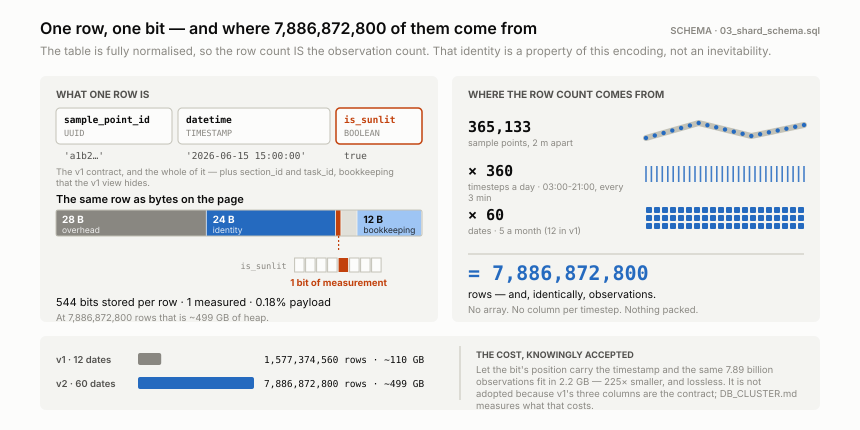
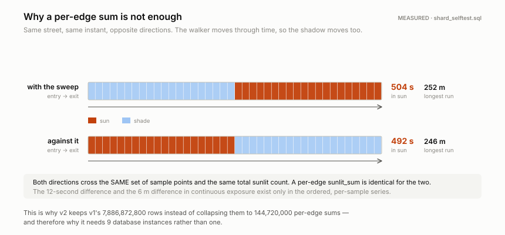
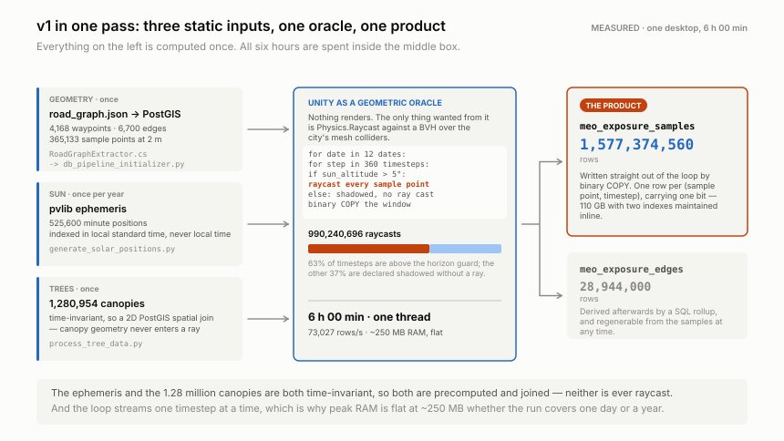
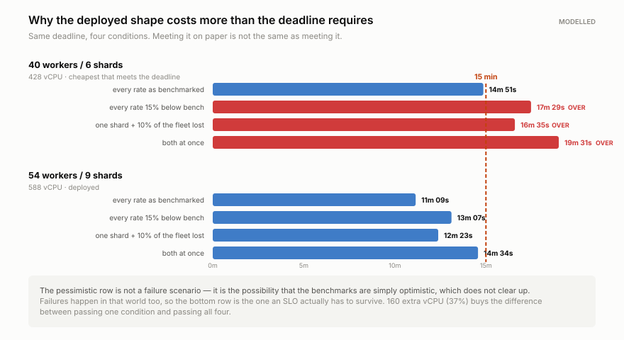
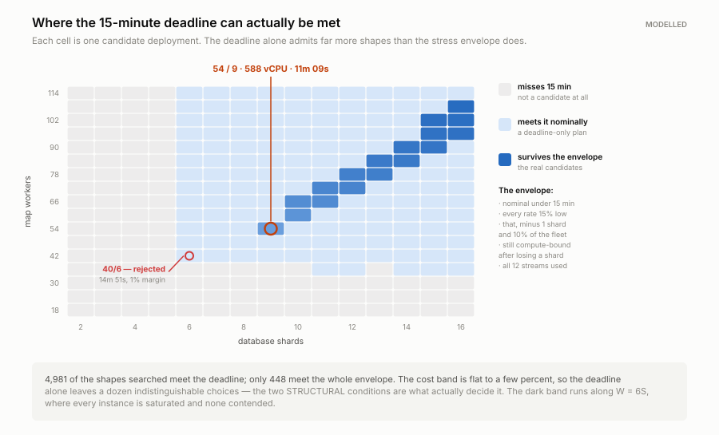
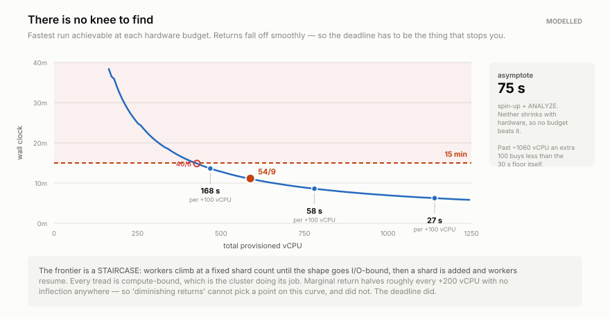
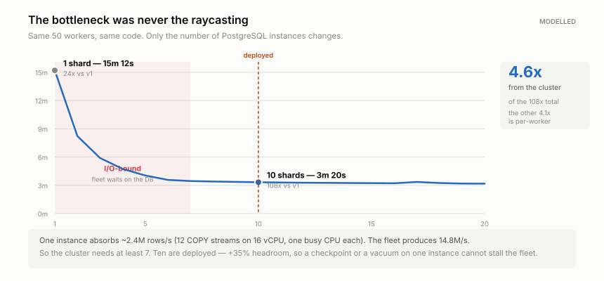
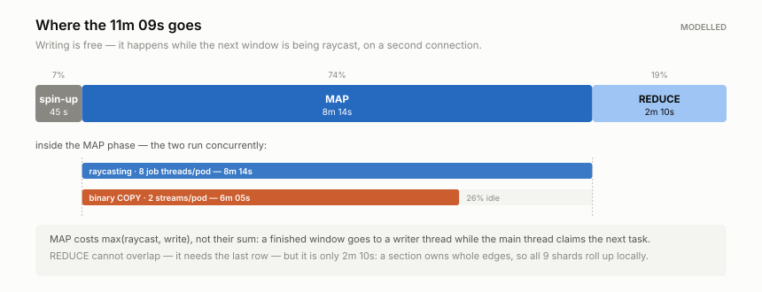
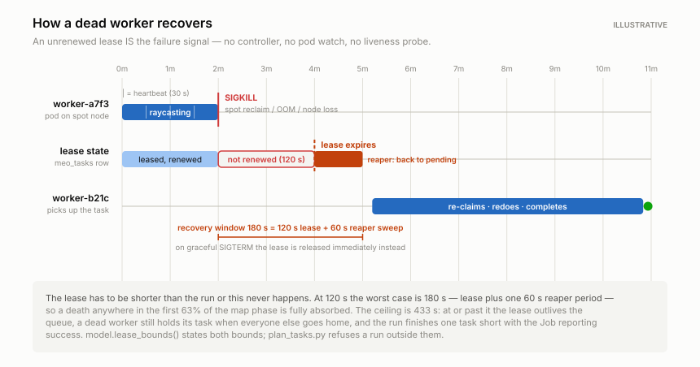

<div align="center">

# SunlightCity

**A large-scale simulation data pipeline for shade-aware pedestrian routing.**

Unity's physics engine is used as a geometric oracle over a real 3D city model,
measuring which patches of street are in sunlight at every 3-minute interval from 03:00
to 21:00 — **one row per sample point per timestep**, kept at full resolution, because
the router that consumes it needs to know which way you are walking.

**v1** — 365,133 sample points × 360 timesteps × **12 dates** = **1.58 billion rows**,
on one desktop, in 6 hours.
**v2** — the same simulation over **60 dates** = **7.89 billion rows**, on 54 Kubernetes
workers and 10 PostgreSQL instances, in **11m 09s** against a 15-minute deadline.

[](https://unity.com/)
[](distributed/unity/Editor/HeadlessBuildScript.cs)
[](distributed/k8s/)
[](distributed/db/)
[](distributed/db/tests/)

<br>

<table>
<tr>
<td align="center" width="25%"><h3>11m 09s</h3><sub><b>for 7.89 billion rows</b><br>a 15-minute deadline,<br>with 26% in hand</sub></td>
<td align="center" width="25%"><h3>6.4×</h3><sub><b>from the DB cluster alone</b><br>54 workers on 1 instance: 1.2 h<br>on 9: 11m 09s</sub></td>
<td align="center" width="25%"><h3>~0</h3><sub><b>WAL for a 500 GB load</b><br>create-then-attach<br>+ <code>wal_level=minimal</code></sub></td>
<td align="center" width="25%"><h3>0</h3><sub><b>coordinators</b><br>an unrenewed lease<br>is the failure signal</sub></td>
</tr>
</table>

</div>

---

## The problem

Ask a routing engine for a walk across Manhattan in July and it will hand you the
shortest path. It has no idea that path is in full sun for twenty minutes while a
parallel street is shaded the whole way.

Making shade a routing objective needs a per-edge, per-time-of-day exposure cost.
Computing that at query time is hopeless — it means ray-mesh intersection against
millions of building triangles while a user waits. So this project moves the entire cost
of that physics **offline**, precomputes it exhaustively, and reduces the result to
something a database can serve instantly.

---

## What the data looks like

Each cell is the share of 365,133 street sample points in direct sunlight, measured on
the hour, for one representative day per month — drawn from v1's 12-date dataset:

<div align="center">
<picture>
  <source media="(prefers-color-scheme: dark)" srcset="docs/assets/exposure_heatmap_dark.svg">
  
</picture>
</div>

The seasonal structure falls straight out of the geometry:

| | Observation | Why |
|---|---|---|
| **Summer plateau** | June–August hold **81–90%** exposure from 10:00 to 13:00 | A high sun clears the building envelope entirely; only the narrowest canyons stay shaded |
| **Winter ceiling** | December peaks at just **51%**, even at solar noon | A low sun means long shadows — roughly half the street grid stays dark all day |
| **Asymmetric shoulders** | June climbs 30%→89% in four morning hours but takes six to fall back | Manhattan's grid sits ~29° off true north, so the street axes align with the morning sun sooner than the evening one |
| **Shoulder-season symmetry** | March and September daylight means differ by only **6 points** (49% vs 55%) | Near-mirrored solar declination — a useful sanity check that the astronomy is right |

> [!NOTE]
> The 08:00 column in October/November and the sharp 14:00→15:00 cliff in winter are
> known near-horizon artifacts, not physical effects. See
> [Known limitations](#known-limitations).

---

## Why the row count is the whole story

The heatmap above is an aggregate. The **product** is one row per (sample point,
timestamp) — 7,886,872,800 of them at v2's 60 dates — and keeping them is what forces
everything else in this repository.

The table is **fully normalised**: `(sample_point_id, datetime, is_sunlit)`, one row per
observation carrying one bit. So the row count *is* the observation count — there is no
array and no column per timestep.

<div align="center">
<picture>
  <source media="(prefers-color-scheme: dark)" srcset="docs/assets/row_anatomy_dark.svg">
  
</picture>
</div>

That encoding is expensive, and knowingly so: **68 bytes of page per bit of payload**. The
packed alternative — lossless, 225× smaller — and why it is not adopted are in
[DB_CLUSTER.md](docs/DB_CLUSTER.md#what-one-row-is-precisely).

### The question an aggregate cannot answer

Nobody experiences a street at a single instant. A walker enters it, and by the time they
are halfway across **the shadow has moved** — so walking east and walking west sample
*different* (sample point, timestamp) pairs against the same advancing clock.

The figure below is one 400 m edge drawn as a **space-time field**: distance along the
street across, time upwards, and **one cell for every row of `meo_exposure_samples`**. The
shadow's edge steps 6.8 m to the right at each 3-minute timestep, so the two walks —
opposite diagonals through that field — cross it in different places and read different
cells.

<div align="center">
<picture>
  <source media="(prefers-color-scheme: dark)" srcset="docs/assets/directional_cost_dark.svg">
  
</picture>
</div>

[`meo_edge_directional_cost()`](distributed/db/03_shard_schema.sql) is what reads one of
those diagonals. The table below **is** the figure above — same edge, same instant, both
directions, on the fixture that
[`shard_selftest.sql`](distributed/db/tests/shard_selftest.sql) builds and asserts:

```sql
SELECT * FROM meo_edge_directional_cost(:edge_id, '2026-06-15 16:00:00',
                                        p_reverse := false, p_walk_speed_mps := 0.5);
```

| | forward | reverse | |
|---|---:|---:|---|
| `sun_seconds` | **504.0** | **492.0** | 12 s more, walking with the sweep |
| `shade_seconds` | 300.0 | 312.0 | |
| `pct_sun` | 62.69 | 61.19 | |
| `entered_in_sun` → `exited_in_sun` | `f` → `t` | `t` → `f` | inverted |
| `longest_sun_run_m` | 252 | 246 | the number a shade-averse router wants |
| `timesteps_spanned` | 5 | 5 | the walk is not one instant |
| per-edge `sunlit_sum` at 16:00 | 133 / 201 | 133 / 201 | **identical — there is no direction in it** |

The fixture walks at 0.5 m/s so that 400 m spans five timesteps and the effect is visible
in a test that runs in two seconds; the asymmetry itself does not depend on the speed.

Both directions cross the same 201 samples, so that last row cannot tell them apart — it
is the answer a *frozen* shadow would give, 532 s of sun, which is neither of the real
two. So `sunlit_sum` is a **derived convenience index** — fine for a Pareto search's
coarse objective, incapable of the question above — and the 7.89 billion sample rows are
the thing that cannot be regenerated from anything else.

Which leads directly to the constraint v2 exists to solve: **one PostgreSQL instance
cannot absorb 7.89 billion rows from 50 concurrent producers.**

---

# v1 · the single-node pipeline

Not a prototype. v1 defines the schema, produced the dataset above, and is still the
right tool for one neighbourhood or a quick check. **Full detail:
[V1_PIPELINE.md](docs/V1_PIPELINE.md).**

| | |
|---|---|
| Hardware | one desktop, one PostgreSQL + PostGIS instance |
| **Wall clock** | **6 h 00 min** |
| Rows | 1,577,374,560 at 73,027 / s — one thread |
| Raycasts | 990,240,696 — only the 63% of timesteps above the horizon guard |
| Written | 110 GB, with two indexes maintained inline |
| Peak RAM | ~250 MB, **flat** — one day or a full year costs the same |

<div align="center">
<picture>
  <source media="(prefers-color-scheme: dark)" srcset="docs/assets/v1_dataflow_dark.svg">
  
</picture>
</div>

Four decisions in v1 that v2 inherits rather than replaces:

**The mesh has no road network in it** — only buildings and ground. The road surface is
the *absence* of buildings, so `RoadGraphExtractor` rasterises to a walkability grid,
takes a BFS distance transform, and keeps the ridge line as a centreline skeleton. The
simplification only ever removes degree-1 and degree-2 nodes, so **junctions survive by
construction** and land precisely at road centres.

**The horizon guard is a correctness fix, not an optimisation.** Near sunrise a ray must
cross kilometres of city, where float precision degrades and the ray can escape the mesh
entirely and falsely report *sunlit* — silent, and the data looks plausible. Declaring
those steps shadowed is cheaper *and* closer to the truth. It also bounds the longest
possible shadow, which turns out to be [what makes v2's spatial sharding exactly
correct](#2--bounding-box-sharding-and-why-it-is-exact).

**1.28 million trees never enter the simulation loop.** Canopy shade is time-invariant,
so it is a 2D PostGIS spatial join rather than geometry in the raycast path.

**The ephemeris runs in local standard time, not local time** — deliberately. It is
indexed as `(dayOfYear−1) × 1440 + minuteOfDay`, which requires exactly 1,440 labelled
minutes per day. A DST zone gives 1,380 on one day and 1,500 on another, and that
silently shifted the sun by an hour for eight months of the year until it was found.
Standard time makes the bug impossible rather than merely absent.

```bash
docker compose up -d          # place 99_data_dump.sql.gz in db/ FIRST
python "Python & DB Scripts/Database/test_connection.py"
# then open the scene, press Play, and use the runtime panel:
#   Reload Data & Snap → Export Sample Points to DB → Export Exposure to DB
```

---

# v2 · the distributed pipeline

Same simulation. Same rows. 54 workers and 10 PostgreSQL instances — both numbers
**derived** from a 15-minute deadline rather than chosen. The derivation is executable:
`python distributed/orchestrator/model.py --derive`.

**Full detail: [ARCHITECTURE.md](docs/ARCHITECTURE.md) ·
[DB_CLUSTER.md](docs/DB_CLUSTER.md) · [OPTIMIZATION.md](docs/OPTIMIZATION.md) ·
[PERFORMANCE.md](docs/PERFORMANCE.md)**

## 0 · How much hardware, and why exactly that much

The work is fixed: 7,886,872,800 observations at v1's exact schema, nothing aggregated
away. The **deadline** is fixed too — a full 60-date run in under **15 minutes**. Neither the
fleet size nor the instance count is given; both are derived from those two facts.

Nine benchmarks, each isolating one lever, compose into a single expression:

```
T(W,S)  =   45   +   max( 26,667/W , 3,286/S )   +   898/S + 30
            ^B8          ^B1-B3      ^B4-B5           ^B6-B7  ^B9
            spin-up      raycast     write            reduce
                         \____ overlap: max() ____/
```

**75 seconds of that is irreducible.** Spin-up and `ANALYZE` shrink with neither workers
nor shards, so no configuration at any price beats 75 s — and the sizing problem is
spending the remaining 825 s well.

Search every integer `(W, S)` against the deadline and the cheapest answer is **40 workers
/ 6 shards at 14m 51s** — a 1.0% margin. It is not deployable, and the figure below is why:

<div align="center">
<picture>
  <source media="(prefers-color-scheme: dark)" srcset="docs/assets/stress_envelope_dark.svg">
  
</picture>
</div>

So the shape must hold 15 minutes under **five** conditions, not one — three deadlines and
two structural:

| | condition | why it exists |
|---|---|---|
| 1 | nominal | the headline |
| 2 | every rate 15% below bench | not a failure scenario — the possibility the model is simply optimistic, which does not clear up |
| 3 | that world, minus one instance and 10% of the fleet | failures happen in the pessimistic world too, and this conjunction is what an SLO has to survive |
| 4 | still compute-bound with headroom at `S−1` | "the fleet never waits on the database" is not a claim about healthy clusters only |
| 5 | every shard offered all 12 `COPY` streams it sustains | nine instances fed ten streams each is capacity bought and unused |

**4,981 shapes meet the three deadlines. Only 448 meet all five.**

<div align="center">
<picture>
  <source media="(prefers-color-scheme: dark)" srcset="docs/assets/feasibility_map_dark.svg">
  
</picture>
</div>

The cost band is flat to a few percent, so **cost does not pick the winner — the two
structural conditions do.** Requiring survival of an instance loss eliminates every
8-shard shape; requiring saturation eliminates 53/9, which buys nine instances and feeds
each of them ten streams out of twelve.

The answer is **54 workers and 9 data shards** — 588 vCPU, 2,050 GB, **11m 09s** nominal
with 26% in hand, and 14m 34s under all three stresses at once. `W = 6S` exactly, which is
why the queue's admission arithmetic comes out even: 9 shards × 6 slots = 54 workers.

And there is **no knee** to have found instead. The cost/time frontier decays as `W⁻²`,
smoothly, with no inflection anywhere:

<div align="center">
<picture>
  <source media="(prefers-color-scheme: dark)" srcset="docs/assets/cost_time_dark.svg">
  
</picture>
</div>

168 s per extra 100 vCPU at 470 vCPU, 58 s at 780, 31 s at 1,140. "Diminishing returns"
cannot select a point on that curve, and did not. The deadline did.

**The whole argument, executable:** `python distributed/orchestrator/model.py --derive` ·
**in prose:** [PERFORMANCE.md §1–§6](docs/PERFORMANCE.md#1-the-requirement)

---

## 1 · The bottleneck was never the raycasting

<div align="center">
<picture>
  <source media="(prefers-color-scheme: dark)" srcset="docs/assets/shard_scaling_dark.svg">
  
</picture>
</div>

A `COPY` backend is **one busy CPU**, so a 16 vCPU instance sustains ~12 productive
streams — 2.4M rows/s — while a 54-worker fleet produces **15.97M rows/s**. Six sevenths
of the fleet would sit waiting.

| shards | wall clock | vs v1 | bound by |
|---:|---:|---:|---|
| 1 | 1.18 h | 25.4× | I/O |
| 4 | 18m 41s | 96.3× | I/O |
| 8 | 11m 21s | 158.6× | compute |
| **9** | **11m 09s** | **161.5×** | **compute** |
| 20 | 10m 14s | 176.0× | compute |
| 30 | 12m 42s | 141.7× | I/O again |

**The cluster is worth 6.4× of the 161× total.** The other 4.05× is per-worker
([§3](#3--the-work-inside-one-worker)); 54 pods multiply it. Neither half alone gets
close, and **adding workers alone would have bought almost none of it.**

Nine is derived, not maximal: the bare minimum is seven, and nine gives **+35% ingest
headroom**, keeps all 12 streams per instance in use, and stays compute-bound after losing
an instance outright. Twenty buys 55 seconds for double the spend. **Past ~27 it gets
worse** — 54 workers cannot offer enough concurrent streams to keep that many instances
busy, so each starves.

Every figure here is `python distributed/orchestrator/model.py`, which is also what the
docs, the charts and `reduce_finalize.py` read, so none of them can drift.

## 2 · Bounding-box sharding, and why it is exact

The natural objection to spatial sharding is that a building *outside* a section casts
shadows *into* it. That objection is answered exactly, not approximately:

> A building of height *H* casts a shadow reaching *H* / tan(θ) at sun elevation θ. Below
> the 5° horizon guard the worker declares shadow **without raycasting**, so θ is bounded
> below and the reach is bounded above:
>
> **200 m / tan 5° = 2,286 m.**

Nothing beyond 2,286 m outside a section can affect a sample inside it. A worker holds the
whole city mesh anyway (~6 GB; pods have 16), so seam correctness is automatic. What
sectioning buys is the **data mapping**, **ray coherence** (a section-local BVH working
set, worth 1.35×), and **read locality**.

Sections own whole **edges**, assigned by midpoint — so `GROUP BY (edge_id, datetime)`
completes inside one instance. No shuffle, and no routing query is ever a cross-shard
join. Had sections been defined by sample-point position, ~12% of edges would straddle a
boundary and both properties would be gone for the life of the dataset.

### Which instance owns which square kilometre

Write balance and read locality pull against each other: hashing section ids balances and
destroys locality; ten contiguous stripes do the reverse.

**Order the sections along a Hilbert curve, then cut that sequence into ten contiguous
runs of equal sample count.** Any contiguous run of a Hilbert curve is a compact connected
region, so one cut satisfies both:

| | Hilbert + balanced cut | a hash |
|---|---:|---:|
| write imbalance | **1.07×** | ~1.0× |
| read contiguity | **0.68** | 0.10 |
| routes touching one shard | **85%** | ~30% |

The cut is **exact** — minimising the heaviest of *k* contiguous runs is the linear-
partition problem, solved by binary search on the bound plus a greedy feasibility test.
`python distributed/orchestrator/cluster.py --show` prints the layout.

## 3 · The work inside one worker

<div align="center">
<picture>
  <source media="(prefers-color-scheme: dark)" srcset="docs/assets/phase_breakdown_dark.svg">
  
</picture>
</div>

| | effect |
|---|---|
| `RaycastCommand.ScheduleBatch` instead of `Physics.Raycast` | **3.0×** — v1's loop was main-thread-only and used one core regardless of the machine |
| section-coherent BVH working set | **1.35×** — 9 km² resident instead of a city-wide sweep |
| flush on a background thread, 2 connections | map phase = `max(ray, write)` not their sum |
| binary `COPY` instead of CSV | ~170 GB less on the wire, ~7.89e9 strings never created |
| allocation-free steady state | **no GC pause in the raycast loop, ever** |
| results as a bitset | 33 KB per window instead of 264 KB |
| `colliderInstanceID` instead of `.collider` | 4.95e9 fewer managed-object lookups |

**Writing is free.** A finished window goes to a writer thread on a second connection
while the main thread claims the next task. In sequence the fleet would spend 43% of its
life on sockets.

**Nothing allocates in the hot path**, and the claim is checkable rather than
aspirational: `AssertNoGarbageCollected()` compares `GC.CollectionCount(0)` across each
window and warns if anything moved. A gen-0 collection mid-window would stall the job
system's threads together and surface as an unexplained heartbeat gap.

Full catalogue, including what was considered and rejected:
**[OPTIMIZATION.md](docs/OPTIMIZATION.md)**.

## 4 · ~500 GB written with no WAL

PostgreSQL skips WAL entirely for a `COPY` into a relation created in the **same
transaction**. So the partition shape was chosen to make that available:

<div align="center">
<picture>
  <source media="(prefers-color-scheme: dark)" srcset="docs/assets/partition_tree_dark.svg">
  
</picture>
</div>

```sql
BEGIN;
  SELECT meo_begin_leaf(section, lo, hi, window, task);   -- CREATE TABLE, standalone
  COPY <leaf> (…) FROM STDIN (FORMAT BINARY, FREEZE);     -- not WAL-logged
  SELECT meo_attach_leaf(section, lo, hi, window);        -- ATTACH PARTITION
COMMIT;
```

One task, one leaf, ~261k rows. Four things at once:

- **No extension-lock contention** — concurrent `COPY` into one heap serialises on it, and
  that is *the* bottleneck for parallel bulk load. Here each writer extends a relation
  nobody else can see.
- **No WAL for ~500 GB.** Not reduced — skipped.
- **`COPY ... FREEZE` is legal**, so no hint-bit writes and no freeze-vacuum of 1.58
  billion rows ever.
- **Idempotent retry without a `DELETE`** — `DETACH` + `DROP` + rebuild is catalog work.

**And no index on the sample table.** Pruning reaches one ~261k-row leaf, which is cheaper
to scan than descending a B-tree over 7.89e9 entries — and not building one saves ~300 GB
and all the load-time maintenance. **Pruning is the index.**

> **`max_wal_size` is the setting most often tuned backwards.** Shrinking it does not
> reduce WAL work — it makes checkpoints *more frequent*, and each one both stalls every
> writer and re-arms full-page-image logging. The two goals live on two knobs:
> `wal_level = minimal` for volume, `max_wal_size` **raised** for checkpoint frequency.
> Full risk ledger: **[TUNING.md](docs/TUNING.md)**.

## 5 · Coordinating 54 workers with 9 instances

One predicate. A shard absorbs ~12 streams and each worker holds two, so at most six
workers should write to any one shard at a time — and nothing about the work distribution
guarantees that. A burst of retries in one region would point thirty workers at one
instance, collapsing its throughput while nine peers idle.

```sql
-- meo_claim_task, in priority order:
--   1. admission control: is this task's shard below its concurrency cap?
--   2. affinity: does it match the caller's warm (section, window) working set?
--   3. LPT: otherwise, the most expensive admissible task
AND t.shard_index = ANY (SELECT meo_admissible_shards(run_id))
```

**Affinity turns 30,240 working-set loads into 504.** Every task in a (section, window)
group shares its geometry and BVH pages, and there are 60 dates per group. The hints
are advisory — if nothing matches, the claim falls through to LPT, so affinity can never
stall the queue.

**Cost is estimated per window, and the spread is 780×.** A 03:00–06:00 window in December
is entirely below the horizon guard; the same window in June is most of a sunrise.
Estimating per day would have made all six of a date's windows look identical.

## 6 · Failure recovery with no failure detector

<div align="center">
<picture>
  <source media="(prefers-color-scheme: dark)" srcset="docs/assets/failure_timeline_dark.svg">
  
</picture>
</div>

Tasks are **leased**, not dequeued. **An unrenewed lease IS the failure signal** — no
coordinator to detect the death, no cleanup path to get wrong:

| detector | misses |
|---|---|
| pod-death watch | network partition · frozen kernel · container running but wedged |
| liveness probe | a process alive but making no progress; false positives in long GC pauses |
| **lease expiry** | **nothing** — it observes progress being *reported* |

Which is why the map Job ships **no `livenessProbe`**. Three details make it safe:

- **Fencing.** `meo_heartbeat()` returns a boolean; a worker that sees `false` abandons
  its work immediately, so the original and its replacement cannot both build the same
  leaf.
- **Idempotency.** Output is one leaf, replaced wholesale — at-least-once delivery is
  sufficient, and exactly-once is never needed.
- **Reaping frees the admission slot, not just the task.** Otherwise every node failure
  would permanently shrink the cluster's write concurrency, invisibly.

A task is completed on the coordinator **only after its rows commit**. Marking it earlier
would let a crash in between leave a task recorded as done with no data — which the
completeness check would pass.

---

## Verified, not asserted

The schema and queue semantics are checked against a real PostgreSQL 16 + PostGIS 3.4,
and the documentation is checked against the capacity model:

```bash
distributed/db/tests/run_selftest.sh                # 45 assertions
python distributed/orchestrator/check_docs.py       # 18 quantities, tree-wide
```

| | |
|---|---|
| [`shard_selftest.sql`](distributed/db/tests/shard_selftest.sql) | v1 column compatibility · window tiling · the create-then-attach write path · `ATTACH` skipping validation · pruning to one leaf · idempotent retry · rollup exactness against a direct aggregate · **directional asymmetry** · orphan sweep |
| [`queue_selftest.sql`](distributed/db/tests/queue_selftest.sql) | LPT ordering · affinity beating LPT · affinity falling through rather than stalling · admission control admitting exactly its cap · completion releasing one slot · fencing · reaping freeing the slot · bounded retries |

The orchestrator was exercised end to end against a live three-shard cluster — grid
derivation, the balanced cut, binary geometry replication across instances, provisioning,
the monitor, and the full reduce including the federation. The three `postgresql.*.conf`
profiles are verified to match `pg_tune.py` exactly, so the documented reasoning and the
generator cannot drift apart.

Assumptions only a real cluster can confirm are listed in
[ARCHITECTURE.md §11](docs/ARCHITECTURE.md#assumptions-that-only-a-real-cluster-can-confirm)
— headless PhysX first, which is what the smoke test in
[DEPLOYMENT.md §6](docs/DEPLOYMENT.md#6-smoke-test--do-this-before-the-fleet) exists to
check.

---

## Results

<div align="center">

| | v1 · one desktop | v2 · 54 workers, 10 instances |
|---|---:|---:|
| dates covered | 12 | **60** |
| rows written | 1,577,374,560 | **7,886,872,800** |
| raycasts fired | 990,240,696 | 4,952,298,879 |
| **wall clock** | **6 h 00 min** | **11m 09s** |
| row rate | 73,027 / s | 15,970,917 / s |
| per worker | 73,027 / s | 295,758 / s |
| sample storage | 110 GB (2 inline indexes) | 499 GB (no index) |
| WAL for the sample load | ~110 GB | **~0** |
| failure recovery | restart the export | per-task, automatic |
| infrastructure | one desktop | 588 vCPU / 2,050 GB |
| cost | 6 desktop-hours | **~109 vCPU-hours** |

</div>

Decomposed honestly: `54 workers × 3.0 batching × 1.35 locality = 218.7×` raw ceiling,
**161.5× achieved** — 74% efficiency, and the missing 26% is the 45 s fleet spin-up plus
the 2m 10s reduce. Both are counted rather than waved away: together they are a **75-second
floor that no amount of hardware beats**, which is why the sizing problem is spending the
other 825 seconds of the budget well.

The hardware is not a guess. Given the deadline, `model.py --derive` searches every integer
(workers, shards) pair against five conditions — three deadlines under stress, two
structural — and returns 54/9 as the cheapest that satisfies all of them. The cheapest
shape that merely meets 15 minutes on paper is 40/6, and losing one database instance puts
it over. **[PERFORMANCE.md §1–§6](docs/PERFORMANCE.md#1-the-requirement)** is the argument
in full.

**Scene:** 4,168 waypoints · 6,700 edges · 365,133 sample points at 2 m spacing ·
1,280,954 tree canopies · 525,600 minute-resolution solar positions per year ·
30,240 tasks over 84 sections × 60 dates × 6 windows.

Full breakdown and sensitivity: **[PERFORMANCE.md](docs/PERFORMANCE.md)**.

---

## Repository layout

```
.
├── docs/
│   ├── V1_PIPELINE.md      ◀── v1 in full: mesh → graph → schema → 6-hour sweep
│   ├── ARCHITECTURE.md         why v2 is shaped this way
│   ├── DB_CLUSTER.md           the 10 instances: sizing, topology, operations
│   ├── OPTIMIZATION.md         every low-level change, with how to verify it
│   ├── PERFORMANCE.md          the numbers, and what the model omits
│   ├── TUNING.md               three PostgreSQL profiles and the risk ledger
│   └── DEPLOYMENT.md       ◀── step-by-step runbook, clone to dataset
│
├── Unity Core Scripts/         v1 engine — the reference implementation
│   ├── Tools/RoadGraphExtractor.cs        mesh → routable graph
│   ├── Pathfinding/                       the export orchestrator + engines
│   └── SolarData/                         binary ephemeris loader
├── Python & DB Scripts/        v1 schema init, tree join, stats, plotting
│
├── distributed/            ◀── v2
│   ├── db/
│   │   ├── 01_cluster_topology.sql    grid · Hilbert · sections · shard registry
│   │   ├── 02_work_queue.sql          leases · admission control · affinity claim
│   │   ├── 03_shard_schema.sql        partition tree · leaf lifecycle · directional API
│   │   ├── 04_bulk_load_tuning.sql    storage params, role-detecting
│   │   ├── 05_post_load_indexes.sql   per-shard rollup · indexes · integrity
│   │   ├── 06_serving_federation.sql  postgres_fdw across the shards
│   │   ├── postgresql.{shard.bulk,shard.serving,coordinator}.conf
│   │   └── tests/                     45 assertions against a real PostgreSQL
│   ├── unity/Runtime/
│   │   ├── SectionExposureSampler.cs      batched rays, allocation-free, bitset
│   │   ├── ExposureWriter.cs             binary COPY on a background thread
│   │   ├── ShardRouter.cs               section → instance, two connections
│   │   ├── SectionGrid.cs               the three-language id contract
│   │   ├── SectionGeometryCache.cs      one warm working set
│   │   ├── WorkQueueClient.cs           claim · heartbeat · fence
│   │   └── HeadlessExposureWorker.cs    the pipelined loop
│   ├── orchestrator/
│   │   ├── model.py                 ◀── the source of every figure in these docs
│   │   ├── cluster.py                  Hilbert order + exact balanced cut
│   │   ├── apply_schema.py             6 files → 2 roles → 10 instances
│   │   ├── plan_tasks.py               topology, provisioning, the queue
│   │   ├── monitor.py                  live dashboard + lease reaper
│   │   ├── reduce_finalize.py          shard fan-out, verification, federation
│   │   ├── pg_tune.py                  role-aware config generator
│   │   └── make_impact_figures.py      the SVGs above
│   ├── docker/                  Unity build stage · ~400 MB runtime · signal-safe entrypoint
│   └── k8s/                     11-instance cluster · pooler · schema · map · reduce · reaper
│
└── unity_simulation_technical_report.html   original algorithmic write-up
```

---

## Getting started

**v1, on a desktop:** [V1_PIPELINE.md §9](docs/V1_PIPELINE.md#9-running-v1) and
[`SetUp Guide.md`](SetUp%20Guide.md).

**v2, on a cluster:** [DEPLOYMENT.md](docs/DEPLOYMENT.md) — thirteen numbered steps with a
check after each. ~4 hours, almost all of it building the Unity image; the pipeline itself
is 11m 09s.

**Neither, just the reasoning:** everything in
[`model.py`](distributed/orchestrator/model.py) and
[`cluster.py`](distributed/orchestrator/cluster.py) runs with no database and no cluster:

```bash
python distributed/orchestrator/model.py            # the full sizing derivation
python distributed/orchestrator/model.py --sweep    # shard-count sensitivity
python distributed/orchestrator/cluster.py --show   # the shard layout, drawn
```

The Unity project — city meshes, colliders, scenes, baked assets — is **~1 GB** and lives
outside git:

> **[⬇ Download SunlightCity Unity Package (Google Drive)](https://drive.google.com/file/d/11OBhZlgjIVjEviUmiUhCcQU3MPTxiVOW/view?usp=sharing)**

---

## Known limitations

Stated plainly, because they are visible in the published data.

**Physical model**

- **Diffuse and reflected light are ignored.** `is_sunlit` is a binary direct-beam test. A
  north-facing street under open sky and a sealed courtyard both read "shadowed".
- **Near-horizon artifacts survive the guard.** The 08:00 column in Oct/Nov and the abrupt
  14:00→15:00 winter cliff are numerical, not physical.
  `DataProcessing/db_correct_spikes.py` zeroes them post hoc, but its sunset heuristic —
  *any* increase after 14:00 is an artifact — is aggressive: in a real city the sun can
  legitimately clear a tall building and re-light a street. **Review its output before
  trusting it**, and note it rewrites both tables and cannot be undone.
- **The graph is planar.** Every node sits at `-112.0`. Manhattan is flat enough; a hilly
  city needs per-node elevation and a revisit of the 2D `ST_DWithin` tree join.
- **Solar data runs in local standard time, not DST** — deliberate, see
  [v1 §5](docs/V1_PIPELINE.md#5-phase-4--the-ephemeris-and-one-bug-worth-the-space).
- **Extraction thresholds are tuned for Manhattan** — `mergeRadius`, the 75° pruning and
  165° dissolution angles were fitted to a dense orthogonal grid.

**Engineering**

- **`O(n²)` preprocessing.** Node clustering in `RoadGraphExtractor` and
  `db_pipeline_initializer.py` is a naive pairwise sweep — minutes at Manhattan scale, a
  one-time cost, but a spatial hash is the fix before scaling to another city.
- **Shard imbalance is reported and gated, not eliminated.** `plan_tasks.py` refuses a
  topology above 1.25× `max/mean`; the reference topology is 1.07×. A smaller
  `--section-meters` gives the balanced cut finer granularity.
- **There is no rebalancing tool.** Changing the shard count moves data;
  re-running the pipeline takes twelve minutes, which is faster than any migration would be
  and leaves nothing to get subtly wrong.
- **`full_page_writes = off` is opt-in and genuinely risky.** Not emitted by default —
  the protection it removes is against a torn page, which is a corrupt relation rather
  than lost rows.
- **Credentials are one cluster-wide password**, plaintext in the v1 scripts and
  placeholders in the K8s manifests. Per-shard credentials would be more rigorous and
  would buy nothing but eleven secrets to rotate in lockstep.
- **The performance figures are derived from a calibrated model**, not a stopwatch on a
  54-node cluster. The v1 baseline is measured; the per-worker multipliers and the
  ingest rate are the model's inputs. `reduce_finalize.py` prints achieved against
  modelled at the end of every run so the first real deployment replaces them. What the
  model omits, and in which direction it errs, is in
  [PERFORMANCE.md §8](docs/PERFORMANCE.md#13-what-the-model-omits-and-which-way-it-errs).

---

## Where things live

| Concern | File |
|---|---|
| Why the schema keeps 7.89e9 rows | [`meo_edge_directional_cost`](distributed/db/03_shard_schema.sql) |
| Batched shadow test, bitset results | [`SectionExposureSampler.cs`](distributed/unity/Runtime/SectionExposureSampler.cs) |
| Binary COPY, off the main thread | [`ExposureWriter.cs`](distributed/unity/Runtime/ExposureWriter.cs) |
| The WAL-free write path | [`meo_begin_leaf` / `meo_attach_leaf`](distributed/db/03_shard_schema.sql) |
| Admission control + affinity | [`meo_claim_task`](distributed/db/02_work_queue.sql) |
| Hilbert order + exact balanced cut | [`cluster.py`](distributed/orchestrator/cluster.py) |
| Every performance number | [`model.py`](distributed/orchestrator/model.py) |
| Fencing on a lost lease | [`WorkQueueClient.Heartbeat`](distributed/unity/Runtime/WorkQueueClient.cs) |
| Graceful preemption | [`entrypoint.sh`](distributed/docker/entrypoint.sh) |
| Mesh → routable graph (v1) | [`RoadGraphExtractor.cs`](Unity%20Core%20Scripts/Tools/RoadGraphExtractor.cs) |

Original algorithmic write-up (rasterisation, MST cycle removal, ephemeris):
[`unity_simulation_technical_report.html`](unity_simulation_technical_report.html).

---

<div align="center">
<sub>Unity as a geometric oracle · a Hilbert curve as a shard key · 7.89 billion rows, kept</sub>
</div>
