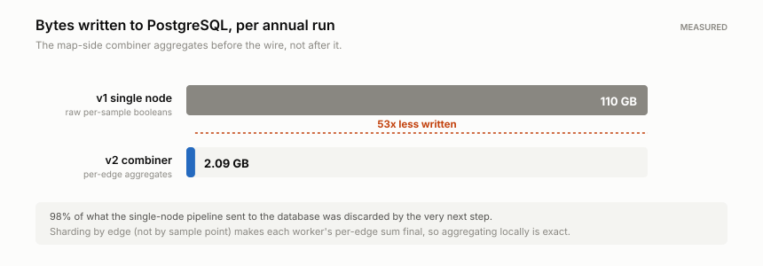
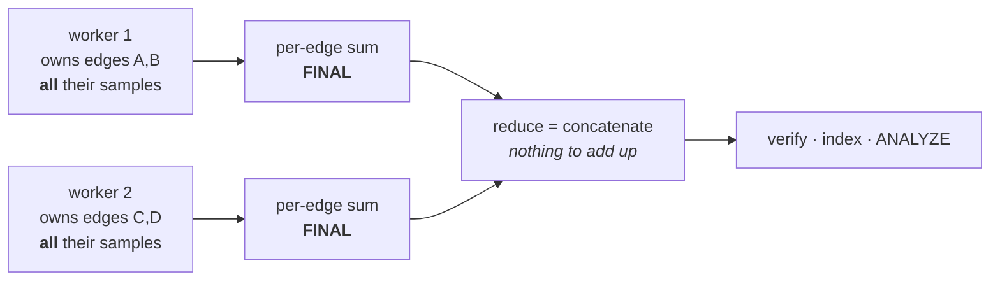
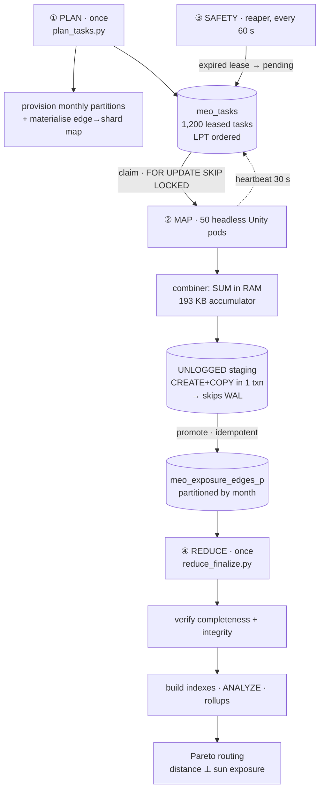
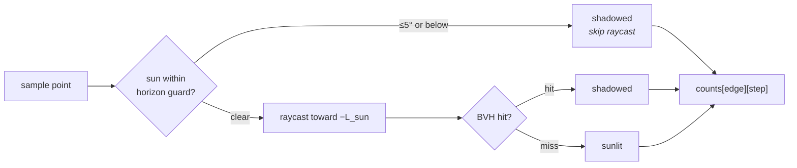
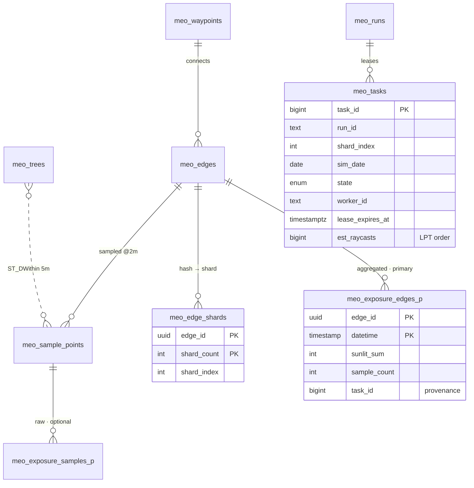

<div align="center">

# SunlightCity

**A large-scale simulation data pipeline for shade-aware pedestrian routing.**

Unity's physics engine is used as a geometric oracle over a real 3D city model, firing
**1.58 billion raycasts** to measure exactly which patches of street are in sunlight at every
3-minute interval across the year — then collapsing that into a lightweight edge-cost table a
multi-objective router can query in O(1).

**v2 turns that from one 6-hour desktop run into a 50-node Kubernetes fleet.**

[](https://unity.com/)
[](distributed/unity/Editor/HeadlessBuildScript.cs)
[](distributed/k8s/)
[](distributed/db/)
[](distributed/orchestrator/)

<br>

<table>
<tr>
<td align="center" width="25%"><h3>53×</h3><sub><b>less written to the DB</b><br>110 GB → 2.09 GB<br><i>measured</i></sub></td>
<td align="center" width="25%"><h3>~30×</h3><sub><b>faster end to end</b><br>6.1 h → ~12 min<br><i>modelled</i></sub></td>
<td align="center" width="25%"><h3>0</h3><sub><b>coordinators</b><br>an unrenewed lease<br>is the failure signal</sub></td>
<td align="center" width="25%"><h3>193 KB</h3><sub><b>to remove 98%<br>of the I/O</b><br>the combiner's whole cost</sub></td>
</tr>
</table>

</div>

---

## The problem

Ask a routing engine for a walk across Manhattan in July and it will hand you the shortest
path. It has no idea that path is in full sun for twenty minutes while a parallel street is
shaded the whole way.

Making shade a routing objective needs a per-edge, per-time-of-day exposure cost. Computing
that at query time is hopeless — it means ray-mesh intersection against millions of building
triangles while a user waits. So this project moves the entire cost of that physics **offline**,
precomputes it exhaustively, and reduces the result to arithmetic the database can serve
instantly.

---

## What the data looks like

Each cell is the share of 365,133 street sample points in direct sunlight, measured on the
hour, for one representative day per month:

<div align="center">
<picture>
  <source media="(prefers-color-scheme: dark)" srcset="docs/assets/exposure_heatmap_dark.svg">
  
</picture>
</div>

The seasonal structure falls straight out of the geometry:

| | Observation | Why |
|---|---|---|
| **Summer plateau** | June–August hold **81–90%** exposure from 10:00 to 13:00 | A high sun clears the building envelope entirely; only the narrowest canyons stay shaded |
| **Winter ceiling** | December peaks at just **51%**, even at solar noon | A low sun means long shadows — roughly half the street grid stays dark all day |
| **Asymmetric shoulders** | June climbs 30%→89% in four morning hours but takes six to fall back | Manhattan's grid sits ~29° off true north, so the street axes align with the morning sun sooner than the evening one |
| **Shoulder-season symmetry** | March and September daylight means differ by only **6 points** (49% vs 55%) | Near-mirrored solar declination — a useful sanity check that the astronomy is right |

> [!NOTE]
> The 08:00 column in October/November and the sharp 14:00→15:00 cliff in winter are known
> near-horizon artifacts, not physical effects. See [Known limitations](#known-limitations).

---

# ⚡ The v2 upgrade

Three changes, in order of how much they matter.

## 1 · Stop shipping data you are about to throw away

<div align="center">
<picture>
  <source media="(prefers-color-scheme: dark)" srcset="docs/assets/io_volume_dark.svg">
  
</picture>
</div>

v1 streamed 1.58 billion raw booleans into Postgres and then aggregated them server-side into
2.09 GB of per-edge sums. **98% of what crossed the wire was discarded by the very next step.**

At 50× parallelism that stops being merely wasteful and becomes the binding constraint. Fifty
workers cannot push 110 GB through one database faster than one worker can — they queue on it.
Naive scale-out converts a CPU-bound pipeline into an I/O-bound one and most of the added
compute idles.

So each worker now aggregates **before** the wire, in RAM:

```
v1:  raycast ─→ 1.58e9 booleans ─→ wire ─→ Postgres ─→ SUM ─→ 2.09 GB
v2:  raycast ─→ SUM in RAM ──────────────→ wire ─→ 2.09 GB
                     ↑
             193 KB accumulator
```

That is Hadoop's *combiner* pattern. The accumulator is
`edges_in_shard × timesteps × 4 B = (6,700/50) × 360 × 4 ≈ 193 KB`. **It costs 193 KB of RAM
to remove 108 GB of I/O.**

### Why it is exact, and why the sharding key is load-bearing

A combiner is only valid if the local reduction is *complete*. That is a property of what you
shard by — and it is the decision the whole design rests on:

| shard by | a worker holds | is its sum final? | so the reduce phase is |
|---|---|:--:|---|
| **edge** ✅ | **all** samples of some edges | **yes** | a *concatenation* — one small pod |
| sample point ❌ | a *fragment* of many edges | no | a cross-worker `SUM`: shuffle + barrier |
| bounding box ❌ | a spatial tile | no | *and it is wrong* — see below |



Because every sample of a given edge lives in exactly one shard, that worker's
per-`(edge, timestep)` sum is **final**. The global reduce never adds anything up — which is why
the reduce phase is one small pod instead of the expensive shuffle stage a classic MapReduce
needs.

> **Spatial (bounding-box) sharding is a trap.** A building *outside* your tile casts shadows
> *into* it, so a spatially-sharded worker must load the whole city mesh anyway — no memory
> saved — while making correctness at the seams delicate. Edge sharding buys the parallelism
> without the correctness problem.

---

## 2 · Failure recovery with no failure detector

<div align="center">
<picture>
  <source media="(prefers-color-scheme: dark)" srcset="docs/assets/failure_timeline_dark.svg">
  
</picture>
</div>

Tasks are **leased**, not dequeued. A worker renews by heartbeat every 30 s against a 900 s TTL.
If the pod is OOM-killed, preempted, or its node dies, the lease expires and the task returns to
the pool.

**There is no coordinator to detect the death and no cleanup path to get wrong.** That is not
just less code — it is strictly *more correct* than the alternatives:

| detector | misses |
|---|---|
| pod-death watch | network partition · frozen kernel · container running but wedged |
| liveness probe | a process alive but making no progress; adds false positives in long GC pauses |
| **lease expiry** | **nothing** — it observes progress being *reported*, the only thing that matters |

Which is why the map Job deliberately ships **no `livenessProbe`**. It could only add false
positives to a signal the heartbeat already covers better.

Two details make it safe rather than merely convenient:

- **Fencing.** `meo_heartbeat()` returns a boolean. A worker that sees `false` has lost
  ownership and *abandons its work immediately* — otherwise the original and the replacement
  would both write output for the same shard.
- **Idempotency.** Output is keyed by `(shard, date)` and `meo_promote_staging()` deletes this
  task's prior output before inserting. A retry **replaces** rather than duplicates, so
  at-least-once delivery is sufficient — and exactly-once, which is unachievable across a
  process boundary, is never needed.

### Load balancing: a pull queue, not an indexed job

Task cost tracks *daylight*, not the wall-clock window, because the worker's horizon guard
skips whole timesteps whose sun is below the threshold:

| date | daylight | est. raycasts/shard |
|---|---:|---:|
| Jun 21 | 14.93 h | 2,182,700 |
| Sep 22 | 11.93 h | 1,744,700 |
| Dec 21 | 9.07 h | 1,321,300 |

A **1.65× spread**. A Kubernetes `Indexed` Job binds work statically, so the makespan would be
set by the slowest shard while the rest of the fleet idled. The pull queue self-balances, and
dispatches longest-first (LPT, makespan ≤ 4/3 of optimal).

`SELECT … FOR UPDATE SKIP LOCKED` makes Postgres the queue. No broker, because the decisive
advantage is transactional: **claiming a task and writing its output share one transaction.**
With RabbitMQ or SQS those are two systems and you inherit the dual-write problem.

---

## 3 · Making PostgreSQL keep up

The combiner cuts write *volume*. Three more problems appear only under concurrency.

| # | what serialises 50 concurrent writers | the fix |
|:--:|---|---|
| **1** | **Relation extension lock.** Every backend needing a new 8 KB page queues on the *same* lock. This is *the* bottleneck for concurrent `COPY` into one heap. | Partition by date. One task = one date = **its own physical relation = its own lock.** 50 workers on 50 dates contend on nothing. |
| **2** | **WAL volume.** Every `COPY`'d row is WAL-logged, and frequent checkpoints re-arm full-page-image logging on top. | `wal_level = minimal` **and** `CREATE`+`COPY` in one transaction → `COPY` skips WAL entirely. Plus *raise* `max_wal_size` so checkpoints are rare. |
| **3** | **Connection churn.** 50 backends sit idle burning ~10 MB each while their workers raycast; pod churn makes connection setup continuous. | PgBouncer in **transaction** mode returns the backend at `COMMIT` — **25 backends serve 50 workers.** |

### The counter-intuitive one

> **"Decrease WAL size" is backwards.** Shrinking `max_wal_size` does not reduce WAL work — it
> makes checkpoints *more frequent*, and each checkpoint both forces every dirty buffer to disk
> (stalling all 50 writers at once) and re-arms full-page-image logging for every page touched
> afterwards. Under sustained bulk load that costs more than the WAL writes it was meant to save.

The goals only conflict if you put them on one knob:

| goal | knob | direction |
|---|---|---|
| reduce WAL **volume per row** | `wal_level = minimal` | — |
| keep checkpoints **rare** | `max_wal_size` | **raise** → 64 GB |

`wal_level = minimal` unlocks the optimisation the worker's staging design exists to claim:
**`COPY` into a relation created in the same transaction skips WAL entirely.**

```sql
BEGIN;
  SELECT meo_create_staging_edges(<task>);   -- CREATE UNLOGGED TABLE …
  COPY   meo_stage_edges_<task> FROM STDIN;  -- ← not WAL-logged
  SELECT meo_promote_staging(<task>, …);     -- into the partition, idempotently
COMMIT;
```

### The risk ledger, stated plainly

The bulk profile trades durability for throughput. That is legitimate **only** because every
byte is reproducible: output is a deterministic function of (mesh, ephemeris, shard, date), the
queue records what completed, and a lost task simply re-runs. Losing the database costs
wall-clock time, not information.

| setting | value | on a crash | verdict |
|---|---|---|---|
| `synchronous_commit` | `off` | last ~200 ms of commits | **safe** — structurally consistent; lost tasks re-run |
| `wal_level` | `minimal` | no replication/PITR *during load* | **safe** — reversible by restart |
| `full_page_writes` | `off` | **torn page → corrupt relation** | **conditional** — needs CoW or atomic 8 KB writes |
| `fsync` | **`on`** | — | *not* disabled: where "aggressive" stops being a good trade |

`pg_tune.py` refuses to emit the bottom two unless explicitly asked, because it cannot detect
whether your storage provides atomic writes. Full reasoning: **[TUNING.md](docs/TUNING.md)**.

---

## Does it actually scale? — and where it stops

<div align="center">
<picture>
  <source media="(prefers-color-scheme: dark)" srcset="docs/assets/scaling_curve_dark.svg">
  
</picture>
</div>

Amdahl, calibrated on the measured single-node run:

```
T(n) = 21,608 s / n  +  300 s
       └─ measured ─┘    └─ serial reduce (index + ANALYZE + rollup)
T(1) = 6.09 h   vs   6.0 h measured   → 1.5% model error
```

| workers | wall clock | speedup | parallel efficiency |
|---:|---:|---:|---:|
| 1 | 6.1 h | 1.0× | 100% |
| 10 | 41 min | 8.9× | 89% |
| **50** | **12.2 min** | **29.9×** | **60%** |
| 100 | 8.6 min | 42.5× | 42% |
| 500 | 5.7 min | 63.8× | 13% |

**The honest number at 50 workers is ~30×, not 50×.** The serial reduce phase imposes a
5-minute floor, so efficiency is 60%. Past ~50, returns diminish sharply — doubling to 100 buys
3.6 minutes. That is *why* the fleet is sized at 50 rather than 500.

> [!IMPORTANT]
> **These are projections, not measurements.** The parallel term is measured; the serial term is
> an estimate; the composition is a model. There was no cluster available to run this on. The
> model also omits image pull, engine boot, shard imbalance and task granularity — all of which
> push the real number **up**. `reduce_finalize.py` reports your achieved throughput against the
> 73k raycasts/s single-node baseline so you can replace these with real figures.

---

## Architecture



Each worker's inner loop:



The horizon guard is a **correctness** fix, not an optimisation: near sunrise a ray must cross
kilometres of city, where float precision degrades and the ray can escape the mesh entirely and
falsely report *sunlit*. Declaring those steps shadowed is both cheaper and closer to the truth.
It also means winter days cost far less than their window length suggests — which is exactly the
cost spread the LPT scheduler exploits.

Full reasoning, including the alternatives rejected and why:
**[ARCHITECTURE.md](docs/ARCHITECTURE.md)**

---

## Data model



`meo_exposure_edges_p` is **RANGE-partitioned by month**, which does triple duty: each in-flight
worker writes its own physical relation (no extension-lock contention), queries prune by
timestamp, and a date's data is retired with `DROP` instead of a 100M-row `DELETE`.

`sample_count` is denormalised beside `sunlit_sum` so consumers compute a sunlit *fraction*
without joining — free, since the worker already knows its own shard's counts.

> **Axis convention**, consistent across every query: `PostGIS (X, Y, Z) = Unity (x, z, y)`.
> PostGIS Y carries the horizontal Unity Z; PostGIS Z carries the vertical. SRID 0 — raw Unity
> world units, not a geographic CRS.

---

## Repository layout

```
.
├── distributed/                     # ◀── the v2 upgrade
│   ├── db/                          # partitioned schema · lease queue · both PG profiles
│   │   ├── 01_distributed_schema.sql        partitions + stable edge→shard hash
│   │   ├── 02_work_queue.sql                SKIP LOCKED leases, heartbeat, reap
│   │   ├── 03_bulk_load_tuning.sql          per-table fillfactor/autovacuum + WAL-skip staging
│   │   ├── 04_post_load_indexes.sql         indexes AFTER the load, ANALYZE, verification views
│   │   └── postgresql.{bulk,serving}.conf   the two profiles
│   ├── unity/
│   │   ├── Runtime/ShardExposureCombiner.cs     ◀── the 53× change
│   │   ├── Runtime/HeadlessExposureWorker.cs    claim→sweep→flush→promote loop
│   │   ├── Runtime/WorkQueueClient.cs           lease + fencing
│   │   ├── Runtime/WorkerConfig.cs              env config, validated at boot
│   │   └── Editor/HeadlessBuildScript.cs        Linux Server subtarget, IL2CPP
│   ├── docker/                      # Unity build stage · ~400 MB runtime · signal-safe entrypoint
│   ├── k8s/                         # Job · PgBouncer · reduce · lease-reaper CronJob
│   └── orchestrator/                # plan · monitor/reap · reduce · pg_tune · figures
│
├── Unity Core Scripts/              # v1 single-node engine (still the reference implementation)
├── Python & DB Scripts/             # v1 schema init, tree join, plotting
├── docs/                            # ARCHITECTURE · DEPLOYMENT · TUNING + figures
└── unity_simulation_technical_report.html
```

---

## Getting started

### 1 · Unity project

The Unity project — city meshes, colliders, scenes, baked assets — is **~1 GB** and lives
outside git:

> **[⬇ Download SunlightCity Unity Package (Google Drive)](https://drive.google.com/file/d/11OBhZlgjIVjEviUmiUhCcQU3MPTxiVOW/view?usp=sharing)**

This build lags the scripts here slightly but is a **known-stable, working configuration** —
start there. `Unity Core Scripts/` mirrors its `Assets/Scripts/`;
`distributed/unity/` is what you add for the fleet.

### 2 · Single node (v1)

Unchanged and still supported — the right choice for one neighbourhood or a quick check.

```bash
docker compose up -d          # place 99_data_dump.sql.gz in db/ FIRST
python "Python & DB Scripts/Database/test_connection.py"
```

Then open the scene, press **Play**, and use the runtime panel:
`Reload Data & Snap` → `Export Sample Points to DB` → `Export Exposure to DB`.

### 3 · Distributed (v2)

```bash
# schema
psql -f distributed/db/01_distributed_schema.sql
psql -f distributed/db/02_work_queue.sql
psql -f distributed/db/03_bulk_load_tuning.sql

# tune PostgreSQL for the load
python distributed/orchestrator/pg_tune.py --detect --workers 50 \
       --profile bulk -o /etc/postgresql/postgresql.bulk.conf && pg_ctl restart

# plan
python distributed/orchestrator/plan_tasks.py --run-id run-2026-annual --shard-count 50

# launch + watch
kubectl apply -k distributed/k8s/
python distributed/orchestrator/monitor.py --run-id run-2026-annual --watch

# finalise
python distributed/orchestrator/reduce_finalize.py --run-id run-2026-annual \
       --verify --build-indexes --refresh-rollups
```

**Smoke-test with 2 workers and one date first** — the riskiest assumption is that PhysX
behaves identically headless, and a 4-shard run confirms it in minutes. Full runbook:
**[DEPLOYMENT.md](docs/DEPLOYMENT.md)**.

---

## Known limitations

Stated plainly, because they are visible in the published data.

**Data**

- **Near-horizon artifacts survive the guard.** The 08:00 spike in Oct/Nov and the abrupt
  14:00→15:00 winter cliff are numerical, not physical.
  `DataProcessing/db_correct_spikes.py` zeroes them post-hoc, but its sunset heuristic (*any*
  increase after 14:00 is an artifact) is aggressive — in a real city the sun can legitimately
  clear a tall building and re-light a street. **Review its output before trusting it.**
- **Diffuse and reflected light are ignored.** `is_sunlit` is a binary direct-beam test. A
  north-facing street in open sky and a sealed courtyard both read "shadowed".
- **The graph is planar.** Every node is pinned to one elevation (`-112.0`). Manhattan is flat
  enough; a hilly city needs per-node elevation and a revisit of the 2D `ST_DWithin` tree join.
- **Solar data runs in local standard time, not DST** — deliberate: the binary is indexed as
  `(dayOfYear−1)×1440 + minuteOfDay`, which requires exactly 1440 labelled minutes per day. A
  DST zone gives 1380 on one day and 1500 on another, which silently shifted the sun by an hour
  for eight months of the year until it was fixed.
- **Extraction thresholds are tuned for Manhattan.** `mergeRadius`, `maxCycleLength`, the 75°
  pruning and 165° dissolution angles were fitted to a dense orthogonal grid.

**Distributed pipeline**

- **The performance figures are modelled, not measured.** No cluster was available. See the
  callout above and [ARCHITECTURE.md §6](docs/ARCHITECTURE.md#6-projected-performance).
- **Not verified end-to-end.** No Kubernetes, Docker daemon, Unity licence or PostgreSQL in the
  authoring environment. Everything was validated as far as it can be statically — 24 C# files
  brace/paren-checked with comments stripped, 12 K8s docs schema-checked for apiVersion,
  request≤limit, env and selector resolution, the entrypoint's signal handling exercised against
  stub players, the planner's daylight model checked against published Manhattan values, and
  `pg_tune` swept over 1,134 host/fleet combinations for memory safety. The five load-bearing
  assumptions are listed in
  [ARCHITECTURE.md §8](docs/ARCHITECTURE.md#8-assertions-not-verified-here); the first
  (headless PhysX) is what the smoke test exists to confirm.
- **`full_page_writes = off` is opt-in and genuinely risky.** Not emitted by default.
- **Shard imbalance is reported, not solved.** Edges have very different sample counts;
  `plan_tasks.py` warns above 1.5× `max/mean`. Raising `--shard-count` averages it out.
- **Credentials are plaintext** in the v1 scripts and placeholders in the K8s manifests. Fine
  for a local container; supply real ones from outside git.
- **`O(n²)` preprocessing.** Node clustering in `RoadGraphExtractor` and
  `db_pipeline_initializer.py` is a naive pairwise sweep — minutes at Manhattan scale, a
  one-time cost, but a spatial hash is the fix before scaling to another city.

---

## Results

<div align="center">

| | v1 · single node | v2 · 50 workers |
|---|---|---|
| raycasts | 1,577,374,560 | 1,577,374,560 |
| wall clock | **6.0 h** *(measured)* | **~12 min** *(modelled)* |
| written to DB | **110 GB** | **2.09 GB** |
| peak worker RAM | ~250 MB | ~8 GB *(city mesh + BVH)* |
| failure recovery | restart the run | per-task, automatic |
| infrastructure | one desktop | 200 vCPU · 400 Gi |

</div>

**Scene scale:** 4,168 waypoints · 6,700 edges · 365,133 sample points at 2 m spacing ·
1,280,954 tree canopies · 525,600 minute-resolution solar positions per year.

---

## Where things live

| Concern | File |
|---|---|
| The 53× change | [`ShardExposureCombiner.cs`](distributed/unity/Runtime/ShardExposureCombiner.cs) |
| Boolean shadow test + horizon guard | [`ShardExposureCombiner.AccumulateTimestep`](distributed/unity/Runtime/ShardExposureCombiner.cs) |
| Lease queue semantics | [`02_work_queue.sql`](distributed/db/02_work_queue.sql) |
| Fencing on lost lease | [`WorkQueueClient.Heartbeat`](distributed/unity/Runtime/WorkQueueClient.cs) |
| WAL-skipping staging | [`03_bulk_load_tuning.sql`](distributed/db/03_bulk_load_tuning.sql) |
| Cost model / LPT order | [`plan_tasks.py`](distributed/orchestrator/plan_tasks.py) |
| Graceful preemption | [`entrypoint.sh`](distributed/docker/entrypoint.sh) |
| Mesh → routable graph (v1) | [`RoadGraphExtractor.cs`](Unity%20Core%20Scripts/Tools/RoadGraphExtractor.cs) |

Original algorithmic write-up (rasterisation, MST cycle removal, ephemeris):
[`unity_simulation_technical_report.html`](unity_simulation_technical_report.html).

---

<div align="center">
<sub>Unity as a geometric oracle · PostGIS as an arithmetic engine · 1.58 billion rays</sub>
</div>
