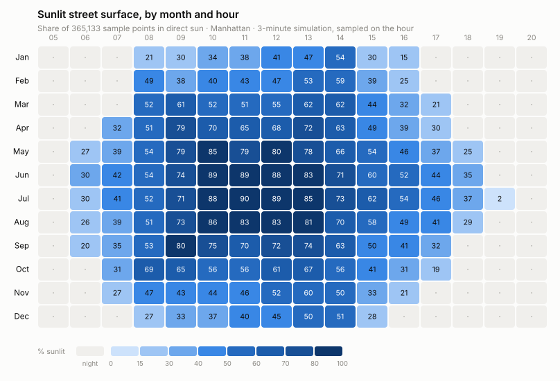
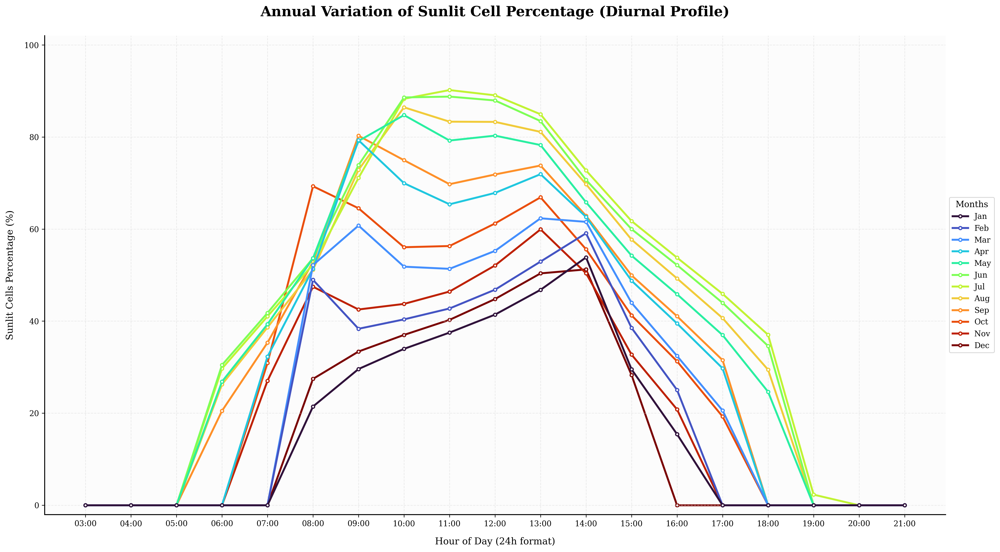
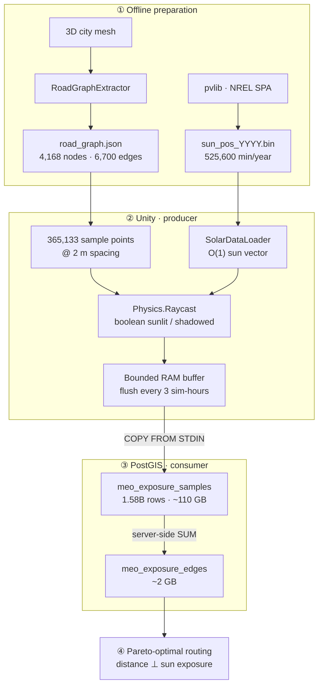
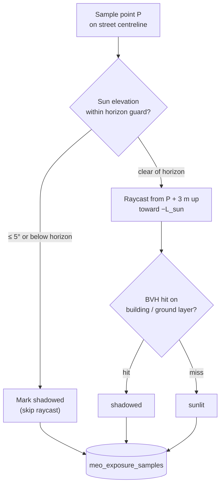
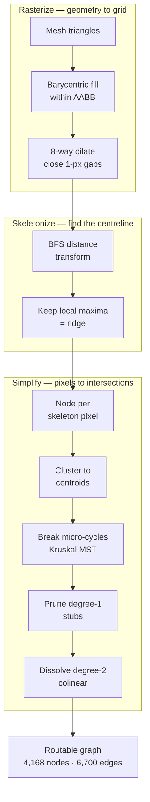
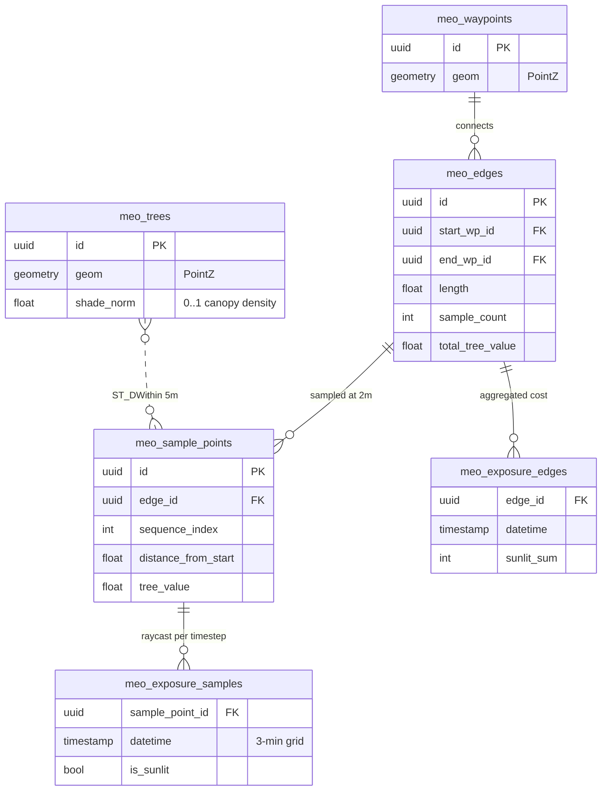

<div align="center">

# SunlightCity

**A large-scale simulation data pipeline for shade-aware pedestrian routing.**

Unity's physics engine is used as a geometric oracle over a real 3D city model, firing
**1.58 billion raycasts** to measure exactly which patches of street are in sunlight at every
3-minute interval across the year — then collapsing that into a lightweight edge-cost table a
multi-objective router can query in O(1).

[](https://unity.com/)
[](https://postgis.net/)
[](https://www.python.org/)
[](https://docs.docker.com/compose/)


</div>

---

## The problem

Ask a routing engine for a walk across Manhattan in July and it will hand you the shortest
path. It has no idea that path is in full sun for twenty minutes while a parallel street is
shaded the whole way.

Making shade a routing objective needs a per-edge, per-time-of-day exposure cost. Computing
that at query time is hopeless — it means ray-mesh intersection against millions of building
triangles while a user waits. So this project moves the entire cost of that physics **offline**,
precomputes it exhaustively, and reduces the result to arithmetic the database can serve
instantly.

---

## What the data looks like

The headline output. Each cell is the share of 365,133 street sample points in direct sunlight,
measured on the hour, for one representative day per month:

<div align="center">
<picture>
  <source media="(prefers-color-scheme: dark)" srcset="docs/assets/exposure_heatmap_dark.svg">
  
</picture>
</div>

The seasonal structure falls straight out of the geometry:

| | Observation | Why |
|---|---|---|
| **Summer plateau** | June–August hold **81–90%** exposure from 10:00 to 13:00 | A high sun clears the building envelope entirely; only the narrowest canyons stay shaded |
| **Winter ceiling** | December peaks at just **51%**, even at solar noon | A low sun means long shadows — roughly half the street grid stays dark all day |
| **Asymmetric shoulders** | June climbs 30%→89% in four morning hours but takes six to fall back | Manhattan's grid sits ~29° off true north, so the street axes align with the morning sun sooner than the evening one |
| **Shoulder-season symmetry** | March and September daylight means differ by only **6 points** (49% vs 55%) | Near-mirrored solar declination — a useful sanity check that the astronomy is right |

> [!NOTE]
> The 08:00 column in October/November and the sharp 14:00→15:00 cliff in winter are known
> near-horizon artifacts, not physical effects. See [Known limitations](#known-limitations).

<details>
<summary><b>Diurnal profile as line series</b> (generated by <code>plot_annual_exposure.py</code>)</summary>

<br>

<div align="center"></div>

Twelve overlaid series is past the point where color alone separates them — the heatmap above
is the more readable encoding of the same data. This view is kept because it makes the
near-horizon artifacts easy to spot as kinks in the curves.

</details>

---

## Architecture

The core design decision is a strict split of labour: **Unity does geometry, PostgreSQL does
arithmetic, and neither waits on the other.**



Three properties make this tractable at scale:

**1 · Bounded memory, unbounded runtime.** Buffering a full year of raycast results before
writing would need tens of gigabytes of RAM and would die in garbage collection. Instead the
buffer flushes every 3 *simulated* hours, so peak memory stays flat (~250 MB) whether the run
covers one day or a year.

**2 · Producer and consumer overlap.** Each flush kicks off a server-side aggregation, then
Unity immediately resumes raycasting. The database is summing block *N* while the physics
engine computes block *N+1* — two CPU pools, no idle waiting.

**3 · The 110 GB never moves.** Aggregation from 1.58 billion booleans to per-edge sums happens
*inside* Postgres. Only the ~2 GB result is ever queried by the router — a **53× reduction** in
the working set.

---

## The measurement

Every data point in this project comes from one primitive: fire a ray from a point on the
street toward the sun and see if anything is in the way.



Two details do most of the work:

**The horizon guard is a correctness fix, not an optimization.** Near sunrise and sunset a ray
must travel kilometres down a street canyon. At that distance floating-point precision degrades
and the ray can slip past the mesh entirely — reporting *sunlit* for a street that is obviously
dark. Anything within 5° of the horizon is declared shadowed instead, which is both cheaper and
closer to the truth. (Unity reports rotations in `[0, 360)`, so a sun 10° below the horizon
reads as 350° — a single `>= 180 − threshold` test catches the whole below-horizon arc.)

**Boolean early-out.** The question is only "is anything in the way", never "what, or how far",
so the raycast returns on its first bounding-volume-hierarchy intersection. A `LayerMask`
restricts the test to buildings and ground. Each one costs microseconds; **~73,000 run per
second** sustained.

---

## Road graph extraction

The routing graph is derived from raw, unstructured city meshes — no OSM, no hand-authored
topology. Morphological image operations turn geometry into a clean graph:



The elegant part is why intersections survive. The simplification passes only ever delete
**degree-1** nodes (dead-end stubs) and **degree-2** nodes (points on a straight line). A real
intersection has degree ≥ 3, so it is *mathematically immune* to deletion. As thousands of
redundant degree-2 vertices dissolve, edges stretch until they anchor on the surviving
junctions — every node in the final graph lands on a real intersection by construction, not by
tuning.

Distinguishing noise from real structure is threshold-driven: cycle removal only considers loops
under `maxCycleLength`, so a 4-node raster artifact at a wide intersection is broken while a
400 m city block is preserved.

---

## Data model



`meo_exposure_samples` is intentionally **append-only with no primary key** — it is written
exclusively via `COPY FROM STDIN` and a unique index at 1.58 billion rows would dominate insert
cost. Resumability is handled by querying existing ids per timestamp instead, which makes an
interrupted multi-hour export safe to restart.

Tree shade takes a completely different path from solar shade. Canopy cover is **time-
invariant**, so it never enters the Unity loop at all: a single SQL statement sums `shade_norm`
for every tree within 5 m of each sample point (`ST_DWithin`), clamped to 1.0 so overlapping
canopies in a dense park can't exceed full coverage. That keeps **1.28 million trees** out of
the physics engine entirely.

> **Axis convention** — consistent across every query in the project:
> `PostGIS (X, Y, Z) = Unity (x, z, y)`. PostGIS Y carries the horizontal Unity Z; PostGIS Z
> carries the Unity vertical. SRID 0 throughout, i.e. raw Unity world units rather than a
> geographic CRS.

---

## Results

<div align="center">

| | |
|---:|:---|
| **1,577,374,560** | raycasts — 365,133 points × 360 steps/day × 12 days |
| **6 hours** | end-to-end wall clock, including all database I/O |
| **~262.8 M/hour** | sustained throughput (~73,000 raycasts/second) |
| **110 GB → 2.09 GB** | working set after server-side aggregation (**53×**) |
| **~250 MB** | peak simulation RAM, independent of run length |

</div>

**Scene scale:** 4,168 waypoints · 6,700 edges · 365,133 sample points at 2 m spacing ·
1,280,954 tree canopies · 525,600 minute-resolution solar positions per year.

---

## Repository layout

```
.
├── Unity Core Scripts/              # C# — 19 files, ~5.8k lines
│   ├── Core/                        # PostGISClient (connection + axis convention)
│   ├── SolarData/                   # Binary loader, interpolation, sun transform
│   ├── Pathfinding/                 # ShadowAwarePathFinder — the export orchestrator
│   │   ├── ShadowAwarePathFinder.cs         # sample + exposure export coroutines
│   │   └── ShadowAwarePathFinder_Engines.cs # WaypointEngine, ShadowEngine, Visualization
│   ├── Tools/RoadGraphExtractor.cs  # mesh → routable graph
│   ├── Environment/ · Visualization/ · Controllers/
│   └── Editor/                      # CSV→binary preprocessor, physics diagnostics
│
├── Python & DB Scripts/             # Python — 22 files, ~2.8k lines
│   ├── Database/                    # schema init, export, backup
│   ├── DataGeneration/              # pvlib solar position generation
│   ├── DataProcessing/              # tree join, spike correction, validation
│   └── Visualization/               # matplotlib + README asset generation
│
├── docs/assets/                     # README figures (regenerable)
├── SetUp Guide.md                   # step-by-step local setup
└── unity_simulation_technical_report.html   # full algorithmic write-up
```

---

## Getting started

### 1 · Unity project

The Unity project — city meshes, colliders, scenes, baked assets — is **~1 GB** and lives
outside git:

> **[⬇ Download SunlightCity Unity Package (Google Drive)](https://drive.google.com/file/d/11OBhZlgjIVjEviUmiUhCcQU3MPTxiVOW/view?usp=sharing)**

This build lags the scripts in this repo slightly but is a **known-stable, working
configuration** — start there. The C# in `Unity Core Scripts/` mirrors the package's
`Assets/Scripts/` and can be dropped in to update it.

### 2 · Database

```bash
# Place the provided 99_data_dump.sql.gz in db/ BEFORE first start —
# Docker only runs the init scripts on an empty volume.
docker compose up -d
docker ps                                   # expect postgis_city on :5432
python "Python & DB Scripts/Database/test_connection.py"
```

Starting a fresh database from scratch instead of a dump:

```bash
python "Python & DB Scripts/Database/db_pipeline_initializer.py"   # ⚠ DROPs all meo_* tables
python "Python & DB Scripts/DataGeneration/generate_solar_positions.py" --cities Manhattan --years 2026
python "Python & DB Scripts/DataProcessing/process_tree_data.py"   # static tree shade
```

### 3 · Npgsql in Unity

```powershell
.\"Python & DB Scripts\Database\db_setup_npgsql.ps1" -ProjectRoot "C:\path\to\UnityProject"
```

Npgsql is pinned to **4.1.12** — later majors target framework features Unity's Mono runtime
doesn't provide.

### 4 · Run the export

Open the main scene, confirm `postgis_city` is up, press **Play**, then from the runtime panel
(or the `ShadowAwarePathFinder` context menu):

| Order | Action | Effect |
|:--:|---|---|
| 1 | `Reload Data & Snap` | Loads the graph for the start/end bounding box |
| 2 | `Export Sample Points to DB` | Generates 2 m sample points along every edge |
| 3 | `Export Exposure to DB` | **The long one.** Sweeps time, raycasts, streams, aggregates |

Set `Export Dates` first — the default is 24 dates (1st + 15th of each month). Both exports are
resumable: they append only what's missing, so an interrupted run can simply be restarted.

### 5 · Verify and plot

```bash
python "Python & DB Scripts/Database/db_sanity_checks.py"              # row counts, indexes
python "Python & DB Scripts/DataProcessing/validate_cumulative_cells.py"  # seasonal curve
python "Python & DB Scripts/Visualization/plot_annual_exposure.py"     # diurnal profile
python "Python & DB Scripts/Visualization/make_readme_heatmap.py"      # README heatmap
```

---

## Known limitations

Stated plainly, because they are visible in the published data:

- **Near-horizon artifacts survive the guard.** The 08:00 spike in October/November and the
  abrupt 14:00→15:00 winter cliff in the charts above are numerical, not physical.
  `DataProcessing/db_correct_spikes.py` detects and zeroes them post-hoc, but the sunset
  heuristic (*any* increase after 14:00 is an artifact) is aggressive — in a real city the sun
  can legitimately clear a tall building and re-light a street. **Review its output before
  trusting it on a new dataset.**

- **Diffuse and reflected light are ignored.** `is_sunlit` is strictly a binary
  direct-beam test. A north-facing street in open sky and a sealed courtyard both read
  "shadowed". Real thermal comfort depends on sky view factor and albedo too.

- **The graph is planar.** Every waypoint and sample point is pinned to one shared elevation
  (`-112.0`). Manhattan is flat enough for this to hold; hilly cities would need per-node
  elevation, and the 2D `ST_DWithin` tree join would need revisiting.

- **Solar data runs in local standard time, not DST.** Deliberate: the binary format is indexed
  as `(dayOfYear − 1) × 1440 + minuteOfDay`, which requires exactly 1440 labelled minutes per
  day. A DST-observing zone gives 1380 on one day and 1500 on another, which silently shifted
  the sun by an hour for eight months of the year. Timestamps in the database are standard
  time — add the offset yourself when comparing against wall-clock observations.

- **Extraction thresholds are tuned for Manhattan.** `mergeRadius`, `maxCycleLength`, the 75°
  pruning angle and the 165° dissolution angle were fitted to a dense orthogonal grid. Expect
  to retune them for a medieval street plan.

- **Credentials are in plaintext.** `admin`/`password` throughout, matching the local
  docker-compose defaults. Fine for a container on localhost; do not point this at anything
  shared.

- **`O(n²)` hot spots in preprocessing.** Node clustering in both `RoadGraphExtractor` and
  `db_pipeline_initializer.py` is a naive pairwise sweep. It runs in minutes at Manhattan scale
  and is a one-time cost, but a spatial hash would be the fix before scaling up.

---

## How the pieces map to the code

| Concern | Where |
|---|---|
| Boolean shadow test | `Pathfinding/ShadowAwarePathFinder_Engines.cs` → `ShadowEngine.IsInShadow` |
| Time sweep, buffering, COPY, aggregation | `Pathfinding/ShadowAwarePathFinder.cs` → `ExportExposureRoutine` |
| Sample point generation | `Pathfinding/ShadowAwarePathFinder.cs` → `ExportSamplesRoutine` |
| O(1) interpolated sun position | `SolarData/SolarDataLoader.cs` → `GetPositionLerped` |
| Mesh → graph | `Tools/RoadGraphExtractor.cs` → `Generate` |
| Schema + indexes | `Database/db_pipeline_initializer.py` |
| Tree shade join | `DataProcessing/process_tree_data.py` |

Full algorithmic detail, including the rasterization and MST derivations, is in
[`unity_simulation_technical_report.html`](unity_simulation_technical_report.html).

---

<div align="center">
<sub>Unity as a geometric oracle · PostGIS as an arithmetic engine · 1.58 billion rays</sub>
</div>
