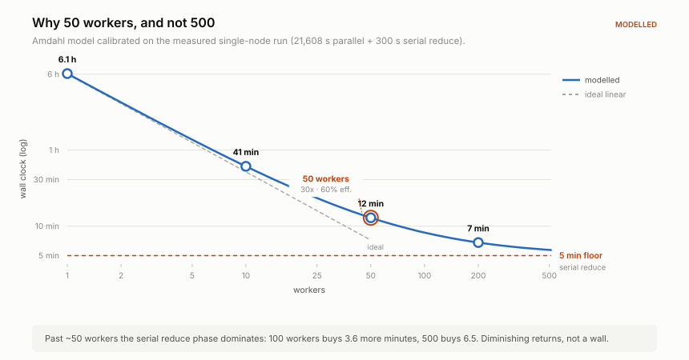

# Architecture — distributed exposure pipeline

This document explains **why** the distributed pipeline is shaped the way it is.
For how to deploy it see [DEPLOYMENT.md](DEPLOYMENT.md); for PostgreSQL parameters
see [TUNING.md](TUNING.md).

---

## 1. What was actually slow

The single-node pipeline computed 1.577 billion raycasts in **6 hours**. It is
tempting to read that as "raycasting is slow, add machines". That reading is wrong,
and getting it right determines the whole design.

Per annual run, the v1 pipeline:

| | volume | fate |
|---|---:|---|
| raw per-sample booleans streamed to Postgres | **110 GB** | aggregated, then never read again |
| per-edge sums the router actually queries | **2.09 GB** | this is the product |

**98% of everything that crossed the wire was discarded by the next step.**

That matters enormously at 50× parallelism. Raycasting is embarrassingly parallel —
50 workers really do 50× the raycasts. But they cannot push 110 GB through one
database 50× faster; they would simply queue on it. Naively scaling out converts a
CPU-bound pipeline into an I/O-bound one and most of the added compute idles.

So the first change is not "more workers". It is **stop sending the 110 GB.**

---

## 2. The map-side combiner

Each worker accumulates `sunlit_count[edge][timestep]` in memory and ships only
the aggregate. This is Hadoop's *combiner*: reduce locally, then reduce globally.

```
v1:  raycast → 1.58e9 booleans → wire → Postgres → SUM → 2.09 GB
v2:  raycast → SUM in RAM       → wire → 2.09 GB
                    ↑
            193 KB accumulator
```

The accumulator is `edges_in_shard × timesteps × 4 bytes`. At Manhattan scale that
is `(6,700 / 50) × 360 × 4 ≈ 193 KB` — utterly negligible. The combiner costs
nothing and removes 98% of the I/O. That asymmetry is what makes the whole approach
worth doing.

### Why this is *exact*, not an approximation

A combiner is only valid if the local reduction is complete. That is a property of
the **sharding key**, and it is the single most load-bearing decision in the design.

| shard by | worker holds | is its sum final? | consequence |
|---|---|---|---|
| **edge** ✓ | all samples of some edges | **yes** | global reduce is a concatenation |
| sample point | a fragment of many edges | no | needs a real cross-worker SUM — a shuffle and a barrier |
| bounding box | a spatial tile | no | *and* it is incorrect (below) |

Sharding by edge means every sample of a given edge lives in exactly one shard, so
that worker's per-`(edge, timestep)` sum is **final**. The reduce phase never adds
anything up — it verifies, indexes, and analyses. That is why
[`40-job-reduce.yaml`](../distributed/k8s/40-job-reduce.yaml) is a single small pod
rather than the expensive shuffle stage a classic MapReduce would need.

**Spatial sharding deserves a specific warning.** It looks natural and it is a
trap: a building *outside* your tile casts shadows *into* it. A spatially sharded
worker must therefore load the entire city mesh anyway — so it saves no memory —
while making correctness at the tile seams delicate. Edge sharding gets the
parallelism without the correctness problem.

---

## 3. Work distribution

### A pull queue, not an indexed job

A Kubernetes `Indexed` Job hands pod *N* work item *N*. Simple, but it binds work
statically, and our tasks are **not** uniform: cost tracks *daylight* hours, not
wall-clock window, because the worker's horizon guard skips whole timesteps whose
sun is below the threshold.

Measured from the daylight model in
[`plan_tasks.py`](../distributed/orchestrator/plan_tasks.py):

| date | daylight | est. raycasts / shard |
|---|---:|---:|
| Jun 21 | 14.93 h | 2,182,700 |
| Sep 22 | 11.93 h | 1,744,700 |
| Dec 21 | 9.07 h | 1,321,300 |

A **1.65× spread**. With static assignment the makespan is set by the slowest shard
while the rest of the fleet idles. A pull queue self-balances: a worker that
finishes early simply takes another task.

Tasks are dispatched **longest-processing-time first**, which bounds makespan at
4/3 of optimal for identical workers. The estimate does not need to be accurate,
only correctly *ordered*.

### Why PostgreSQL is the queue

`SELECT … FOR UPDATE SKIP LOCKED` makes Postgres a correct, efficient queue, and
the pipeline already depends on Postgres. Adding RabbitMQ/Redis/SQS would add a
second failure domain to operate for no gain at this scale (a few hundred tasks,
50 consumers).

The decisive advantage is transactional: claiming a task and writing its output
share **one** transaction. With an external broker those are two systems and you
inherit the dual-write problem — output committed but the ack lost, or vice versa.

---

## 4. Failure handling

Tasks are **leased**, not merely dequeued. A worker renews its lease by heartbeat
every 30 s against a 900 s TTL.

<div align="center">
<picture>
  <source media="(prefers-color-scheme: dark)" srcset="assets/failure_timeline_dark.svg">
  
</picture>
</div>

**An unrenewed lease IS the failure signal.** There is no coordinator to detect the
death and no cleanup path to get wrong. This is not a convenience — it is strictly
more correct than the obvious alternatives:

| detector | misses |
|---|---|
| pod-death watch | network partition; frozen kernel; container running but wedged |
| liveness probe | a process alive but making no progress; adds false positives in long GC pauses |
| **lease expiry** | *nothing* — it observes progress being reported, which is the only thing that matters |

That is why the map Job deliberately has **no `livenessProbe`**. It would be a
second, weaker detector capable only of false positives.

### The fencing problem

Lease expiry alone is unsafe: after reassignment, the *original* worker might still
be alive and about to write. So `meo_heartbeat()` returns a boolean, and a worker
that sees `false` **abandons its work immediately**. The heartbeat doubles as a
fencing token.

### Idempotency

Every task's output is keyed by `(shard_index, sim_date)`, and
`meo_promote_staging()` deletes this task's prior output before inserting. A retry
*replaces* rather than duplicates. At-least-once delivery is therefore sufficient —
we never need exactly-once, which is fortunate, because exactly-once across a
process boundary is not achievable.

Retries are bounded (`max_attempts = 3`), after which a task parks in `failed`
rather than retrying forever. A deterministically broken task — corrupt mesh
region, out-of-range date — would otherwise spin indefinitely and starve the queue.

---

## 5. Removing the database bottleneck

The combiner cuts write *volume*. Three further problems appear only under
concurrency.

### Relation extension lock

Concurrent `COPY` into one heap serialises on the relation-extension lock: every
backend needing a new 8 KB page queues on the same lock. This is *the* bottleneck
for concurrent bulk load into a single table.

The fix is declarative partitioning by date. Each task is scoped to one date →
writes one partition → **its own physical relation → its own extension lock.**
Partitioning by date (not by edge hash) also aligns with how the data is queried
(by timestamp) and retired (`DROP` a partition instead of a 100M-row `DELETE`).

### WAL volume

This is where the intuitive instinct is backwards. "Decrease WAL size" — meaning
`max_wal_size` — makes things *worse*: it makes checkpoints more frequent, and each
checkpoint re-arms full-page-image logging for every page touched afterwards. Under
sustained bulk load that costs more than the WAL writes themselves.

The correct decomposition is two separate goals on two different knobs:

| goal | knob | direction |
|---|---|---|
| reduce WAL **volume per row** | `wal_level = minimal` | — |
| keep checkpoints **rare** | `max_wal_size` | **raise** to 64 GB |

`wal_level = minimal` unlocks the optimisation the worker's staging design exists
to claim: **`COPY` into a relation created or truncated in the same transaction
skips WAL entirely.** So the worker does, in one transaction:

```
CREATE UNLOGGED TABLE meo_stage_edges_<task>   -- same transaction …
COPY   … FROM STDIN                            -- … so this is not WAL-logged
SELECT meo_promote_staging(...)                -- move into the partition
COMMIT
```

Full reasoning and the risk ledger: [TUNING.md](TUNING.md).

### Connection churn

50 workers each hold a connection for minutes but only talk to the database for
seconds of it — the rest is raycasting. Without pooling, 50 Postgres backends sit
idle burning ~10 MB each plus `work_mem` per sort node.

PgBouncer in **transaction** mode returns the backend at `COMMIT`, so 25 backends
serve 50 workers. This is safe *specifically because* the worker's critical section
is one transaction. What transaction mode would break, and how the pipeline avoids
each:

| breaks | avoided by |
|---|---|
| session-level `SET` | `SET` inside the transaction |
| `TEMP` tables across transactions | named `UNLOGGED` staging tables |
| advisory locks held across transactions | lease *rows* |
| implicit prepared statements | `Pooling=false`, no auto-prepare, `DISCARD ALL` on reset |

---

## 6. Projected performance

<div align="center">
<picture>
  <source media="(prefers-color-scheme: dark)" srcset="assets/scaling_curve_dark.svg">
  
</picture>
</div>

Amdahl, calibrated on the measured single-node run:

```
T(n) = T_parallel / n + T_serial
       T_parallel = 1.577e9 / 73,000 = 21,608 s     ← measured
       T_serial   ≈ 300 s                            ← reduce: index + ANALYZE + rollup
```

`T(1) = 6.09 h` against a **measured 6.0 h** — 1.5% error, so the model is sound.

| workers | wall clock | speedup | efficiency |
|---:|---:|---:|---:|
| 1 | 6.1 h | 1.0× | 100% |
| 10 | 41 min | 8.9× | 89% |
| **50** | **12.2 min** | **29.9×** | **60%** |
| 100 | 8.6 min | 42.5× | 42% |
| 500 | 5.7 min | 63.8× | 13% |

**The honest number at 50 workers is ~30×, not 50×.** The serial reduce phase
imposes a 5-minute floor, so parallel efficiency is 60%. Past ~50 workers returns
diminish sharply: doubling to 100 buys 3.6 minutes.

> These are **projections**. This environment has no cluster, so nothing here is a
> measurement. The parallel term is measured; the serial term is an estimate; the
> composition is a model. Treat the 12-minute figure as "the right order of
> magnitude", and measure your own with
> `reduce_finalize.py`, which reports achieved throughput against the 73k/s baseline.

### What the model omits

Deliberately, and all of these push the real number **up**:

- **Image pull** on a cold 50-node cluster (~400 MB each).
- **Engine boot + BVH build** per pod, tens of seconds on a cold page cache.
- **Shard imbalance** — edges have very different sample counts; `plan_tasks.py`
  reports `max/mean` and warns above 1.5×.
- **Task granularity** — 24 dates × 50 shards = 1,200 tasks over 50 workers is 24
  tasks each, coarse enough that the last round leaves some workers idle.

---

## 7. Component map

| Concern | Where |
|---|---|
| Boolean shadow test | `ShardExposureCombiner.AccumulateTimestep` |
| In-RAM aggregation | `ShardExposureCombiner._counts` |
| Claim / heartbeat / fence | `WorkQueueClient` + `db/02_work_queue.sql` |
| Worker lifecycle, SIGTERM | `HeadlessExposureWorker` + `docker/entrypoint.sh` |
| Headless build | `unity/Editor/HeadlessBuildScript.cs` |
| Partitioning, shard map | `db/01_distributed_schema.sql` |
| WAL-skipping staging | `db/03_bulk_load_tuning.sql` |
| Cost model, LPT ordering | `orchestrator/plan_tasks.py` |
| Completeness + integrity | `orchestrator/reduce_finalize.py` |
| Lease reaping | `orchestrator/monitor.py` + reaper CronJob |

---

## 8. Assertions not verified here

This environment has no Kubernetes, no Docker daemon, no Unity licence and no
PostgreSQL. The following are stated from knowledge and **must be confirmed on
first deployment**:

1. **PhysX raycasting works in a headless Server-subtarget build.** `Physics.Raycast`
   is a CPU BVH traversal with no GPU involvement. High confidence; this is the
   assumption the entire containerisation rests on, so verify it first with a
   1-shard smoke run.
2. **A Unity Personal licence permits headless Linux server builds.** Unity gates
   Personal by revenue, not build target.
3. **`wal_level = minimal` + same-transaction `CREATE` + `COPY` skips WAL.**
   Documented PostgreSQL behaviour. Verify with `pg_current_wal_lsn()` before and
   after a task.
4. **IL2CPP requires managed stripping disabled for Npgsql.** Npgsql resolves type
   handlers reflectively, which IL2CPP's static analysis cannot see. This is the
   most likely single cause of a "works in Editor, breaks in container" failure.
5. **The quoted throughput figures.** Everything in §6 beyond `T_parallel` is
   modelled.
