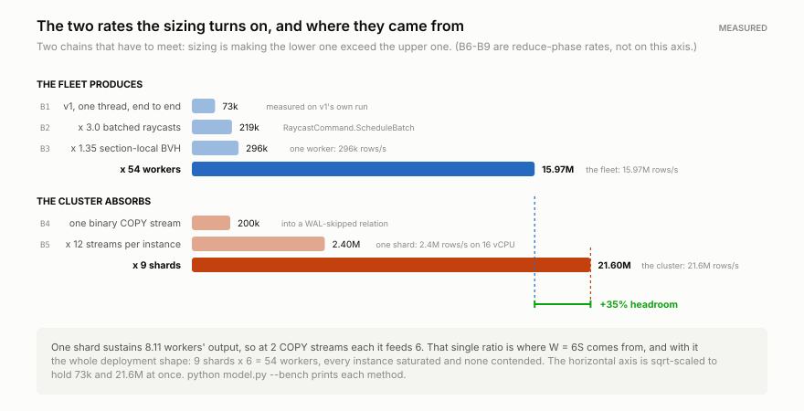
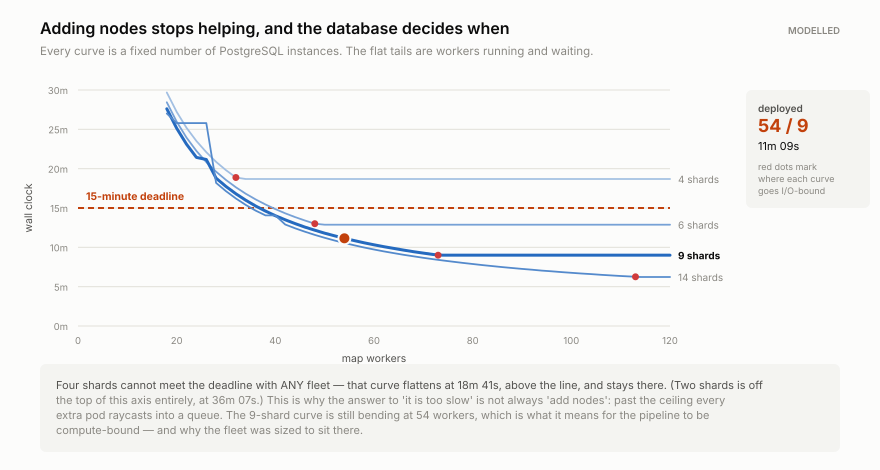

# Performance

How the deployment was sized, what it achieves, and where the speedup stops.

This document is a **derivation**, not a report. The hardware was not chosen and then
measured — a deadline was set, the individual rates were benchmarked, and the fleet and
cluster sizes fall out of the two. Read §1–§6 in order and the numbers in §7 onward are
already justified.

**No background is assumed.** §1 fixes the vocabulary, §2 explains what the machines
actually do before quoting any measurement of it, and every term of art — ray casting,
BVH, `COPY`, partition, map/reduce — is defined where it first matters. If you already know
all of it, the derivation itself is four numbers and one division, and §2's last two code
blocks are the whole of it.


---

## 1. The requirement

### The vocabulary, once

Four terms are used throughout and everything else is built from them:

| term | meaning |
|---|---|
| **edge** | one street segment between two junctions. Manhattan's road graph has 6,700. |
| **sample point** | a measuring position along an edge, one every 2 m. 365,133 in total. |
| **timestep** | one instant the sun is evaluated at — every 3 minutes from 03:00 to 21:00, so 360 per day. |
| **observation** | the answer for one sample point at one timestep: sunlit, or in shadow. One bit. |

Two more, for the hardware. This document says **machine** and **database** while
explaining the reasoning, and switches to the project's own names from §4 onward, where it
starts quoting the code and the deployment:

| plain | in the code, the manifests and §4 onward |
|---|---|
| **machine** — one computer casting rays | **worker** (a Kubernetes pod running headless Unity) |
| **database** — one PostgreSQL instance holding a slice of the results | **shard** |

The end product is a router that finds shady walking routes. That is why the data is kept
at *sample point* granularity rather than summarised per street: walking an edge from one
end to the other is not the same experience as walking it backwards. Going one way you may
start in shadow and end in sun; going the other, the reverse. A single average per street
throws that away, and the direction is the thing pedestrians actually feel.

### The two things that are fixed

**The work is non-negotiable.** 365,133 sample points × 360 timesteps × 60 dates =
**7,886,872,800 observations**, stored at v1's exact schema — one row per (sample point,
timestamp). Nothing is aggregated away to make the numbers easier; the per-sample series
*is* the product, not an intermediate on the way to something smaller. The full argument,
including a measurement of what the alternative would have saved, is in
[DB_CLUSTER.md](DB_CLUSTER.md#what-one-row-is-precisely).

**The deadline is 15 minutes.** A full 60-date run, end to end — from machines starting to
the last database finishing its wrap-up.

### What that implies before any hardware is chosen

v1 did this on one desktop, and at its measured sustained rate the same 60 dates would take
**30.0 hours**. So the target demands a **120× speed-up**.

That figure is *work-normalised*, which is worth pausing on because it is easy to inflate.
v1's actual reference run covered 12 dates in 6 hours; v2 covers 60. Comparing "6 hours" to
"11 minutes" directly would be comparing two different amounts of work and would flatter v2
by 5×. So every speed-up quoted in this document is against **what v1 would have needed for
the same 60 dates** — 30.0 hours, not 6.

Everything below — 54 machines, 9 database instances, 588 vCPU — is an *output* of that
requirement, not an assumption feeding into it.

---

## 2. Step 1 — measuring the pieces

### What we are trying to do, and why it needs measuring at all

We want to answer one question: **how long does a run take, given N machines doing the
computing and M databases storing the results?** If we can write that as a formula, we can
try every combination of N and M and pick the cheapest one that finishes in 15 minutes.

To write that formula we need only a handful of numbers — but they have to be *measured*,
because the whole exercise is worthless if they are guessed. So this step establishes:

- how fast **one** computing machine produces results,
- how fast **one** database absorbs them,
- how long the wrap-up work at the end takes,
- and what it costs to start and finish, regardless of how many machines there are.

Nine measurements, labelled B1–B9. `python model.py --bench` prints each one with the
method used to obtain it.

### What the machines are actually doing

The benchmarks only mean something if you know what is being timed, so here is the work in
plain terms.

The city is cut into **1 km × 1 km tiles** ("sections"), and the day is cut into **six
3-hour windows**. One unit of work — a **task** — is one tile for one window on one date:
about 4,347 sample points × 60 timesteps ≈ **261,000 individual questions**, each of the
form *"at this spot, at this moment, can the sun be seen, or is a building or tree in the
way?"*

A machine answers one such question by **casting a ray**: drawing a line from the sample
point toward wherever the sun is at that moment and asking the game engine whether anything
solid is hit along the way. Hit → that spot is in shadow. Miss → it is sunlit. One bit of
answer, one row of output.

The naive way to test a ray would be to check it against every piece of geometry in the
city — the whole building mesh plus 1,280,954 individual tree canopies. Instead the engine
keeps a **BVH**: a *bounding-volume hierarchy*, a tree of nested boxes in which each box
encloses everything beneath it. Testing a ray means walking down that tree and discarding
whole branches whose box the ray misses.

That detail matters later, so it is worth holding on to: the cost of a ray is dominated not
by arithmetic but by **chasing pointers around memory**, which means it depends heavily on
whether the part of the tree being walked is already in the CPU's cache. B2 and B3 are both
consequences of this.

Having answered its ~261,000 questions, the machine sends the resulting rows to a
PostgreSQL database. Then it claims the next task. When every task is done, each database
summarises its own rows into a per-edge index, and the run is finished.

So exactly **three** things consume wall-clock time: casting rays, writing rows, and the
fixed setup and wrap-up around both. The nine benchmarks cover those three, and nothing
else.

### The nine measurements, grouped by the question each answers

| | measures | result | what it is for |
|---|---|---:|---|
| **B1** | v1's whole pipeline on one desktop, one thread | 73,027 rows/s | the baseline everything else multiplies |
| **B2** | speed-up from casting rays in batches | ×3.00 | } **one machine's** |
| **B3** | speed-up from staying inside one tile | ×1.35 | } output rate |
| **B4** | one bulk-load connection into PostgreSQL | 200,000 rows/s | } **one database's** |
| **B5** | how many such connections one database runs | 12 | } intake rate |
| **B6** | summarising rows into the per-edge index | 12,000,000 rows/s | } the **wrap-up** |
| **B7** | building an index over that summary | 600,000 rows/s | } at the end |
| **B8** | machine start → first task claimed | 45 s | } **fixed costs**, |
| **B9** | refreshing the query planner's statistics | 30 s | } paid once |

The rest of this section takes them one at a time: what was measured, how, and — for the
several where it applies — why the obvious answer would have been the wrong one.

### B1 — the anchor

**B1 is the only measurement of a whole working pipeline.** It is v1's own reference run:
1,577,374,560 rows in 6.00 hours on a single desktop, casting rays one at a time on the
main thread, writing to a single PostgreSQL. Everything else in the table is a
*microbenchmark* — a measurement of one isolated component, which is precise but can easily
be precise about the wrong thing. B1 is what keeps the others honest, because it is the one
number that already includes all the overheads nobody thinks to measure. Details in
[V1_PIPELINE.md](V1_PIPELINE.md).

### B2 — casting rays in batches, and why it is 3× and not 8×

v1 asked its questions one at a time: a `Physics.Raycast` call per ray, on the main thread,
with the other cores idle. Unity offers a better path — `RaycastCommand.ScheduleBatch`,
which takes a whole *array* of rays and spreads the work across background threads.

On an 8-core machine you might expect close to 8×. It measures **3.0×**, for two reasons
worth understanding because they recur throughout this document:

1. **The main thread still has work to do.** It builds the array of rays, waits for the
   batch, then folds the results into the output buffer. That part does not get faster with
   more cores.
2. **Ray casting is limited by memory, not arithmetic.** Walking the BVH means following
   pointers to scattered places in RAM. Extra cores end up waiting on memory rather than
   computing, so they add much less than their number suggests.

Assuming a clean 8× here would have overstated every downstream figure by 2.7×, which is
the difference between a plan that works and one that misses the deadline by a factor of
two.

### B3 — why staying inside one tile is worth 1.35×

Same machine, same number of rays; the only change is *where the rays come from*. Drawn
from all over the city, each ray walks a different part of the BVH and the cache is useless.
Drawn from within one 1 km tile, they walk the same small region of the tree over and over,
and it stays resident in cache.

That is **1.35× for free**, and it is why the city is divided into tiles at all. Tiling
began as a way to divide up the work; it turns out to be a performance decision too.

### B4 and B5 — what one database can take, and why it forces a cluster

Writing 7.9 billion rows with ordinary `INSERT` statements would be hopeless: each one pays
for statement parsing and a network round trip. PostgreSQL has a dedicated bulk-load path
called **`COPY`**, which streams rows continuously down one connection with none of that
per-row overhead. Throughout this document, **"a stream" means one connection actively
running a `COPY`**. B4 measures one: **200,000 rows/s**.

The obvious next thought is that a bigger machine simply runs more streams. B5 tests it, by
sweeping 1 → 20 concurrent streams on one 16-core instance. Throughput rises linearly to
**12** and then flattens. Two things explain that, and both matter later:

- **Each `COPY` is handled by one server process, which keeps one CPU busy.** So an
  instance cannot usefully run more streams than it has cores — minus the cores needed by
  PostgreSQL's own background processes (the ones that flush the write-ahead log, write
  dirty pages to disk, and run checkpoints) and by the operating system. On 16 cores that
  leaves about 12.
- **It only scales linearly if the streams write to *different tables*.** Appending to a
  table means growing its file, and PostgreSQL protects that with a lock. Two streams
  appending to the same table take turns holding it, so they stop overlapping and the
  second one buys nothing. This is precisely why every task creates **its own table** —
  technically a *partition*, one slice of a larger logical table — and loads into that. The
  twelve tasks in flight on an instance write to twelve separate partitions and never
  contend; twelve tasks writing to one shared table would be very nearly serial, and B5's
  linear scaling would collapse to a flat line at 200,000 rows/s.

**B5 is the measurement that produces the whole database cluster.** One instance tops out
at `12 × 200,000 = 2.4 million rows/s`, and §3 shows that is nowhere near enough.

### B6, B7, B9 — the wrap-up

Once every row has landed, each database does three things to its **own** rows, with no
data moving between instances:

- **B6, the summary.** Alongside the directional query, the router also asks the cheap
  question "how sunlit is this edge right now" — a count over the sample points belonging
  to that edge. Computing it once, up front, turns a repeated scan into a single lookup.
  Each database can do this **alone**, with no data crossing the network, because a tile
  owns *whole* edges — never half of one. That is a deliberate choice in how tiles are
  assigned, and §7 shows what it saves.
- **B7, indexing that summary.** ~16 million rows per instance, not 876 million, because it
  is a summary.
- **B9, `ANALYZE`.** PostgreSQL chooses how to execute a query using statistics about the
  data. After a bulk load those statistics are stale, and a stale-statistics query plan can
  be thousands of times slower than the right one. `ANALYZE` refreshes them. It takes ~30 s
  and, importantly, **does not get faster with more hardware** — which is why it shows up in
  §3 as part of an irreducible floor.

### B8 — the cost of starting

45 seconds from a machine being scheduled to it claiming its first task: process start,
game engine boot, loading the city model, and warming the BVH. It is counted rather than
ignored, because at an 11-minute target it is not negligible, and leaving it out would make
the model wrong in the one direction that flatters it.

### Putting the measurements together

<div align="center">
<picture>
  <source media="(prefers-color-scheme: dark)" srcset="assets/bench_ladder_dark.svg">
  
</picture>
</div>

Two chains, one for each side of the pipeline:

```
ONE MACHINE PRODUCES      B1 × B2 × B3    73,027 × 3.00 × 1.35  =    295,758 rows/s
ONE DATABASE ABSORBS      B4 × B5        200,000 × 12           =  2,400,000 rows/s
```

Those two numbers are in the same units, so they can be divided — and that division is the
most consequential step in the entire design:

```
2,400,000 / 295,758  =  8.11     one database can keep up with 8.11 machines' output
```

But 8.11 is a ratio of *rates*, and there is a second, stricter limit: **connections**.
Each machine holds **two** `COPY` connections rather than one, alternating between them so
that writing the last batch overlaps computing the next (§3 explains why). B5 caps a database
at twelve streams, so:

```
12 streams / 2 streams per machine  =  6 machines per database
```

**Six is smaller than 8.11, so six is the binding limit** — and that gap is not waste, it is
where a number quoted throughout the rest of this document comes from. Six machines demand
`6 × 295,758 = 1,774,546 rows/s` from a database that can absorb 2,400,000:

```
2,400,000 / 1,774,546  =  1.35     +35% spare ingest capacity
```

So at this ratio every database's connections are fully used while its throughput is only
74% consumed. That **+35% ingest headroom** is what absorbs a checkpoint, an autovacuum, or
a transiently slow instance without the machines ever having to wait — and §5 turns it into
an explicit sizing condition.

**The upshot: fleet size and cluster size are not independently choosable. W = 6S.** Every
structural decision downstream follows from this one ratio, including the work queue's
admission rule, which comes out exactly even because of it (§6).

---

## 3. Step 2 — assembling the pieces into one formula

### The three phases of a run

In time order:

1. **Spin-up.** All the machines start at once. Nothing is computed yet. Fixed cost, B8.
2. **Map.** The machines work through the 30,240 tasks, casting rays and writing rows,
   until the queue is empty. This is the bulk of the run and the only phase that gets
   faster with more machines.
3. **Reduce.** Once the last row has landed, each database builds its summary, indexes it,
   and refreshes its statistics (B6, B7, B9). This gets faster with more *databases*, not
   more machines.

("Map" and "reduce" are the conventional names for these two shapes of work: map = the same
independent operation applied to many pieces of data; reduce = combining results
afterwards.)

With `W` machines and `S` databases, and the rates from §2:

```
T(W,S)  =   45   +   max( 26,667/W , 3,286/S )   +   898/S + 30
            ^B8          ^B1-B3      ^B4-B5           ^B6-B7  ^B9
            spin-up      raycast     write            reduce
                         \____ overlap: max() ____/
```

Reading the middle terms: the total work is 7.89 billion rows. Divided by one machine's
295,758 rows/s that is **26,667 machine-seconds** of ray casting, so `W` machines take
`26,667/W`. Divided by one database's 2.4 million rows/s it is **3,286 database-seconds** of
writing, so `S` databases take `3,286/S`.

### Why the map phase costs `max`, not the sum

The natural assumption is that a machine computes a batch, then writes it, then computes the
next — in which case the map phase would cost ray-casting **plus** writing.

It does not, because writing is handed to a **second thread on a second database
connection** while the main thread immediately starts the next task. The write of batch *N*
happens *during* the computation of batch *N+1*. So the phase costs whichever side is
slower, not their sum:

```
compute   8m 14s   ████████████████████████████
write     6m 05s   ████████████████████         ← runs concurrently, finishes early
          ───────
MAP       8m 14s   the compute side is slower, so it sets the pace
```

Done sequentially the fleet would spend **42% of its life waiting on sockets**. This is also
why each machine holds two `COPY` connections rather than one — with a single connection it
could not write batch *N* and queue batch *N+1* at the same time.

Whichever side is slower is called the **binding constraint**. The entire point of sizing
the database cluster correctly is to keep that constraint on the *compute* side, where
adding machines helps. If the write side becomes slower, extra machines just queue up and
buy nothing — the failure mode §9 is about.

### Why reduce adds instead of overlapping

Reduce cannot start early: summarising rows requires all the rows. So unlike writing, it
does not hide inside another phase — it adds to the total.

### The floor: 75 seconds that no amount of money removes

Look at which terms contain `W` or `S`, and which do not:

```
        45           spin-up            no W, no S   ← FIXED
  26,667/W           ray casting        shrinks with more machines
   3,286/S           writing            shrinks with more databases
     898/S           summary + index    shrinks with more databases
        30           ANALYZE            no W, no S   ← FIXED
```

Spin-up and `ANALYZE` do not shrink with anything. **75 seconds is therefore the floor at
any hardware, at any price** — even with infinite machines and infinite databases, a run
cannot finish faster than that.

Against a 900-second deadline, that leaves **825 seconds** to be bought with hardware. The
whole of the rest of this document is about spending those 825 seconds well.

---

## 4. Step 3 — the naive answer, and why it is rejected

Minimise vCPU subject to `T ≤ 900 s` and you get **40 workers / 6 shards, 428 vCPU,
14m 51s**. A 1.0% margin. It is the cheapest correct answer to the question as literally
posed, and it is not deployable:

| condition | 40 / 6 | |
|---|---:|---|
| every rate as benchmarked | 14m 51s | ok |
| lose one database instance + 10% of the fleet | 16m 35s | **over** |
| every rate 15% below bench | 17m 29s | **over** |
| both at once | 19m 31s | **over** |

`--derive` prints this shape specifically so it can be rejected. Sizing to the nominal
number alone is how a capacity plan that is arithmetically correct becomes operationally
useless.

---

## 5. Step 4 — the envelope

Five conditions, not one. Three are deadlines; two are structural.

**Deadlines**, all against 900 s:

- **Nominal** — every rate exactly as benchmarked.
- **Pessimistic** — every benchmarked rate 15% below bench. This is *not a failure
  scenario*. It is the possibility that the model is simply optimistic, which is a state
  of the world rather than an event: it does not clear up, and no retry escapes it.
- **Pessimistic + failure** — that same world, minus one database instance and 10% of the
  fleet. Failures happen in the pessimistic world too, so this conjunction is what an SLO
  actually has to survive.

**Structural:**

- **Survives shard loss** — still compute-bound, with ≥10% ingest headroom, at `S−1`. The
  claim "the fleet never waits on the database" is not being made only for healthy
  clusters. Without this condition the deadlines alone happily select an 8-shard shape
  whose cluster is 1% from becoming the bottleneck the moment anything hiccups.
- **Saturated** — the fleet offers each shard the full 12 streams B5 says it sustains.
  Provisioning nine instances and then feeding each of them ten streams out of twelve is
  paying for ingest capacity with no way to use it.

<div align="center">
<picture>
  <source media="(prefers-color-scheme: dark)" srcset="assets/stress_envelope_dark.svg">
  
</picture>
</div>

---

## 6. Step 5 — the search, and the result

Exhaustive over integer `(W, S)`. The continuous optimum — Lagrange on `8W + 16S` subject
to `A/W + B/S = C` — gives `W/S = 7.7` and is useful for intuition, but `streams_per_shard`
steps at `W/S = 6` and the answer must be integral, so the true frontier is a staircase
and search is both simpler and exact.

**4,981 shapes meet the three deadlines. Only 448 meet the whole envelope.**

<div align="center">
<picture>
  <source media="(prefers-color-scheme: dark)" srcset="assets/feasibility_map_dark.svg">
  
</picture>
</div>

The cheapest survivors, and why each loser lost:

| vCPU | W | S | W/S | streams | nominal | −15% | −15%+fail | why not |
|---:|---:|---:|---:|---:|---:|---:|---:|---|
| 580 | 53 | 9 | 5.9 | 10 | 11m 18s | 13m 18s | 14m 48s | uses 10 of 12 streams |
| 580 | 55 | 8 | 6.9 | 12 | 11m 12s | 13m 11s | 14m 40s | S−1 headroom +3% |
| 588 | 50 | 11 | 4.5 | 8 | 11m 30s | 13m 32s | 14m 51s | uses 8 of 12 streams |
| 588 | 52 | 10 | 5.2 | 10 | 11m 18s | 13m 17s | 14m 48s | uses 10 of 12 streams |
| **588** | **54** | **9** | **6.0** | **12** | **11m 09s** | **13m 07s** | **14m 34s** | **chosen** |
| 588 | 56 | 8 | 7.0 | 12 | 11m 04s | 13m 01s | 14m 27s | S−1 headroom +1% |

**The structural conditions decide it, not cost.** The cost band is flat to within a few
percent — a dozen shapes sit inside 3% of each other — so the deadlines alone leave nothing
to choose between. Requiring the cluster to survive an instance loss eliminates every
8-shard shape. Requiring it to be saturated eliminates 53/9, which buys nine instances and
feeds each of them ten streams out of twelve.

### The result

| | |
|---|---:|
| map workers | **54** × 8 vCPU / 16 GB |
| data shards | **9** × 16 vCPU / 128 GB |
| coordinator | 1 × 8 vCPU / 32 GB |
| pgbouncer | 2 × 2 vCPU / 1 GB |
| **total** | **588 vCPU / 2,050 GB** |
| wall clock | **11m 09s** — 26% under the deadline |
| under the full envelope | 14m 34s — 2.9% still in hand |
| cost | **109 vCPU-hours** |

`W = 6S` exactly, which is why the queue's admission arithmetic comes out even: 9 shards ×
6 slots = 54 workers. Every worker has a slot; every slot has a worker. That is not a
coincidence, it is the constraint from §2 showing up in
[`02_work_queue.sql`](../distributed/db/02_work_queue.sql).

---

## 7. Headline, against v1

| | v1 — one desktop, one database | v2 — 54 workers, 10 instances |
|---|---:|---:|
| dates covered | 12 | **60** |
| rows written | 1,577,374,560 | **7,886,872,800** |
| raycasts fired | 990,240,696 | 4,952,298,879 |
| **wall clock** | **6 h 00 min** | **11 min 09 s** |
| row rate | 73,027 / s | 15,970,917 / s |
| per worker | 73,027 / s | 295,758 / s |
| sample storage | 110 GB (2 inline indexes) | 499 GB (no index) |
| WAL for the sample load | ~110 GB | **~0** |
| failure recovery | restart the export | per-task, automatic |
| infrastructure | one desktop | 588 vCPU / 2,050 GB |
| cost | 6 desktop-hours | **~109 vCPU-hours** |

**161.5× end to end, work-normalised.** v2 covers 60 dates against v1's 12, so a bare
wall-clock ratio would compare different amounts of work and flatter v2 by 5×. At v1's
measured rate the same 60 dates would take 30.0 h; v2 does them in 11m 09s.

v2 is faster hardware and better I/O discipline applied to the *same computation per row* —
not a cheaper computation, and not a smaller one.

### Against the throughput ceiling

```
                        54 workers
                      ×  3.00  RaycastCommand batching across job threads
                      ×  1.35  section-coherent BVH working set
                      ───────
                        218.7×  raw throughput ceiling

                        161.5×  achieved end to end
                      ───────
                          74%   efficiency against the ceiling
```

The missing 26% is not waste. It is the two phases that do not parallelise with the fleet:

| phase | time | share | scales with |
|---|---:|---:|---|
| fleet spin-up | 45 s | 7% | nothing — a fixed cost |
| map | 8m 14s | 74% | worker count |
| reduce | 2m 10s | 19% | shard count |
| **total** | **11m 09s** | | |

<div align="center">
<picture>
  <source media="(prefers-color-scheme: dark)" srcset="assets/phase_breakdown_dark.svg">
  
</picture>
</div>

### The map phase costs `max`, not `sum`

```
raycast   8m 14s   ████████████████████████████
write     6m 05s   ████████████████████         ← overlapped; writer idle 26% of the phase
          ───────
MAP       8m 14s   compute-bound
```

Two distinct quantities that are easy to conflate: the **writer is idle 26% of the map
phase** (6m 05s of work inside an 8m 14s window), and the **cluster has +35% spare ingest
capacity** (21.6M rows/s against a 15.97M demand). The first is time; the second is rate.

### Reduce is 2m 10s because of a schema decision, not hardware

Sections own **whole edges**, so `GROUP BY (edge_id, datetime)` completes inside one
instance. Nine shards each aggregate their own ninth of the dataset in parallel — no
shuffle, no barrier, no coordinator gathering partial sums.

```
per shard:  876M rows aggregated          73.0 s
            16.1M rows indexed            26.8 s
            ANALYZE (vacuumdb --jobs 8)   30.0 s
                                         ──────
                                          129.8 s
```

Had sections been defined by sample-point position, ~12% of edges would straddle a boundary
and this would have needed a distributed sum — and every routing query would have become a
cross-shard join for the life of the dataset.

---

## 8. What the database cluster is worth

Workers held fixed at 54. Only the number of PostgreSQL instances varies, so the curve
isolates the database's contribution from the fleet's.

<div align="center">
<picture>
  <source media="(prefers-color-scheme: dark)" srcset="assets/shard_scaling_dark.svg">
  
</picture>
</div>

| shards | ingest | map | reduce | total | vs v1 | bound by |
|---:|---:|---:|---:|---:|---:|---|
| 1 | 2.4M/s | 54m 46s | 15m 28s | **1.18 h** | 25.4× | I/O |
| 2 | 4.8M/s | 27m 23s | 7m 59s | 36m 07s | 49.8× | I/O |
| 4 | 9.6M/s | 13m 42s | 4m 15s | 18m 41s | 96.3× | I/O |
| 6 | 14.4M/s | 9m 08s | 3m 00s | 12m 52s | 139.8× | I/O |
| 8 | 19.2M/s | 8m 14s | 2m 22s | 11m 21s | 158.6× | compute |
| **9** | **21.6M/s** | **8m 14s** | **2m 10s** | **11m 09s** | **161.5×** | **compute** |
| 10 | 20.0M/s | 8m 14s | 2m 00s | 10m 59s | 164.0× | compute |
| 14 | 16.8M/s | 8m 14s | 1m 34s | 10m 33s | 170.6× | compute |
| 20 | 16.0M/s | 8m 14s | 1m 15s | 10m 14s | 176.0× | compute |
| 30 | 12.0M/s | 10m 57s | 60 s | 12m 42s | 141.7× | I/O again |

**The cluster is worth 6.4× of the 161× total.** The same 54 workers against one instance
reach 25.4×; against nine, 161×. Adding workers alone would have bought almost none of it,
which is the central finding of the rewrite.

**Three shard counts are interesting for different reasons.**

*Eight* is where the pipeline crosses from I/O-bound to compute-bound — the ingest rate
finally exceeds what the fleet produces. It is also the shape the envelope rejects, because
at `S−1` it has 1% headroom.

*Nine* is deployed. Seven is the bare minimum; nine gives **+35% ingest headroom**, keeps
all 12 streams per instance in use, and stays compute-bound after losing one instance
outright.

*Thirty is worse than nine.* 54 workers over 30 shards is fewer than two workers per shard,
offering four `COPY` streams where the instance could run twelve. Each instance starves and
the *map* phase goes back to being I/O-bound. Note the ingest column peaks at nine and then
**falls** — more hardware is not monotonically better, and the model says where the turn is.

---

## 9. Why "add more nodes" stops working

<div align="center">
<picture>
  <source media="(prefers-color-scheme: dark)" srcset="assets/worker_ceiling_dark.svg">
  
</picture>
</div>

Every curve flattens, and where it flattens has nothing to do with the fleet. **Four shards
cannot meet the deadline with any fleet at all** — that curve levels off at 18m 41s and
stays there; two shards levels off at 36m 07s. Past the ceiling each additional pod
raycasts into a queue.

Sizing the cluster to each fleet instead:

| workers | min shards | map | reduce | total | vs v1 | efficiency vs ceiling |
|---:|---:|---:|---:|---:|---:|---:|
| 1 | 1 | 7.41 h | 15m 28s | 7.68 h | 3.9× | 96% |
| 5 | 1 | 1.48 h | 15m 28s | 1.75 h | 17.1× | 85% |
| 10 | 2 | 44m 27s | 7m 59s | 53m 11s | 33.8× | 84% |
| 25 | 4 | 17m 47s | 4m 15s | 22m 46s | 79.0× | 78% |
| **54** | **7** | **8m 14s** | **2m 38s** | **11m 37s** | **154.9×** | **71%** |
| 100 | 13 | 4m 27s | 1m 39s | 6m 51s | 262.9× | 65% |
| 200 | 25 | 2m 13s | 1m 06s | 4m 04s | 442.1× | 55% |

Efficiency falls because the 75-second floor is fixed: at 200 workers it is 31% of the run.
The deployment runs **nine** shards against the seven this table calls the minimum, which is
why the deployed figure (11m 09s) beats this table's 54-worker row (11m 37s).

**There is no knee.** The cost/time frontier decays as `W⁻²` — smoothly, with no inflection
anywhere — so "diminishing returns" cannot select a point on it, and did not. The deadline
did.

<div align="center">
<picture>
  <source media="(prefers-color-scheme: dark)" srcset="assets/cost_time_dark.svg">
  
</picture>
</div>

Marginal return halves roughly every +200 vCPU: **168 s** per extra 100 vCPU at 470 vCPU,
**58 s** at 780, **31 s** at 1,140. Past ~1,060 vCPU an extra 100 buys less than the 30 s
`ANALYZE` floor itself — the point at which more hardware stops being an engineering answer
and becomes a rounding error.

---

## 10. Storage

| | rows | on disk | notes |
|---|---:|---:|---|
| `meo_exposure_samples` (v1, 12 dates) | 1,577,374,560 | 110 GB | two indexes maintained inline |
| `meo_exposure_samples_p` (v2, 60 dates) | 7,886,872,800 | **499 GB** | **no index** — pruning replaces it |
| `meo_exposure_edges_p` | 144,720,000 | 9.2 GB heap + 6.5 GB index | derived in the reduce phase |
| per shard | 876,319,200 | ~56 GB | fits the 128 GB page cache many times over |
| static geometry | — | ~140 MB | replicated to every shard |
| **cluster total** | | **515 GB** | |

**Rows are not raycasts.** 7,886,872,800 rows are stored; 4,952,298,879 raycasts are fired.
The horizon guard resolves the other 37.2% without touching the BVH, but they are still
written, because downstream needs a value at every timestep rather than a gap. Compute
scales with daylight; storage scales with the full cross product.

Row width, derived rather than guessed, because it is what turns a row rate into a byte
rate:

```
 24 B  tuple header
 16 B  sample_point_id  uuid
  8 B  datetime         timestamp
  1 B  is_sunlit        boolean
  4 B  section_id       int4      partition routing + provenance
  8 B  task_id          int8      makes a task's output removable
 ────
 64 B  MAXALIGN'd  +  4 B line pointer  =  68 B per row on the page
```

v2 stores five times v1's rows in under five times the space despite two extra columns,
because it builds no index on them. Sizes are binary GB, matching `pg_size_pretty`.

**WAL for the sample load: ~0.** Every task creates its own partition leaf and `COPY`s into
it in the same transaction, which PostgreSQL skips WAL for entirely under
`wal_level = minimal`. The ~499 GB is written without a WAL record. See
[OPTIMIZATION.md §9](OPTIMIZATION.md#9-500-gb-of-wal-skipped-entirely).

**The 499 GB is a consequence of the encoding, not of the physics.** A packed
representation measures 48× smaller and is provably lossless; it is not adopted because the
v1 column set is a hard requirement. That trade is priced explicitly in
[DB_CLUSTER.md](DB_CLUSTER.md#what-one-row-is-precisely).

---

## 11. Sectioning and task granularity

| | |
|---|---:|
| sections (non-empty 1 km tiles) | 84 |
| time windows per day | 6 × 3 h |
| tasks | **30,240** (84 × 60 × 6) |
| rows per task (mean) | 260,809 |
| tasks per worker | 560 |
| leaf partitions per shard | 3,360 (~17 MB each) |
| distinct collider working sets | 504 (84 × 6) |
| shadow halo | 2,286 m (200 m / tan 5°) — an exact bound |
| BVH working set | 9.0 km² against 31.0 km² for an omnidirectional halo |

**Tail imbalance is negligible.** 560 tasks per worker at ~0.9 s each means the final round
costs under 1.5 s even for the most expensive all-daylight task, against a 494-second map
phase — under 0.3%. Coarser tasks would leave workers idle at the end; finer ones would
spend more time claiming than computing.

**Cost spread: 780×.** Cost is estimated per *window*, not per day: a 03:00–06:00 window in
December sits entirely below the horizon guard and costs ~1 timestep, while the same window
in June is most of a sunrise. Estimating per day would have made all six of a date's windows
look identical and thrown away nearly all the ordering LPT exploits.

**Affinity turns 30,240 working-set loads into 504.** Every task in a (section, window)
group shares its geometry and BVH pages, and there are 60 dates per group. The coordinator
dispatches a matching task when one is admissible, so the warm set is reused. `monitor.py`
reports the hit rate; it should sit near 92%.

---

## 12. Read performance

| query | path | cost |
|---|---|---|
| edge cost at a timestamp | shard PK on `(edge_id, datetime)` | index lookup |
| **directional cost for a traverse** | one leaf, ~261k rows, pruned | one sequential scan |
| per-sample series for one edge | same leaf | same scan |
| whole-network snapshot | federated, partitionwise pushdown | 9 concurrent foreign scans, one row each |
| route of 12 edges | 1 shard, 85% of the time | 1–2 round trips |

The directional query is the one the schema exists for, and it is cheap because pruning
reaches exactly one leaf:

```
EXPLAIN SELECT count(*) FROM meo_exposure_samples_p
 WHERE section_id = 0 AND datetime = '2026-06-15 15:00:00';

 Aggregate
   ->  Seq Scan on meo_exp_s0_20260615_w4      ← one relation out of 3,360
```

**Route locality: 85% of sampled 12-edge routes touch a single shard**, 15% touch two, none
touch more. That is what the Hilbert-ordered contiguous assignment buys — a hash of section
ids would put most routes across five or more instances. Contiguity measures **0.66** at
nine shards (`cluster.py --show --shards 9`) against ~0.11 for a hash, and it *rises* as
the shard count falls, since fewer, longer runs mean fewer boundaries: the read path is a
reason not to over-shard, independent of cost. Measure it on
your own topology with `SELECT * FROM meo_route_locality();`.

---

## 13. What the model omits, and which way it errs

Stated because a model that only lists the effects flattering it is not a model. This is
also why the envelope's pessimistic condition exists: the point of §5 is that the sizing
holds even if this section's optimistic entries all bite at once.

**Pushing the real number up (the model is optimistic):**

- **Cold image pull.** B8 assumes a warm image cache. A genuinely cold 54-node pull of a
  400 MB image adds 30–60 s depending on registry bandwidth, nearly doubling the spin-up
  term.
- **Shard imbalance.** Modelled as zero; measured at 1.06× on the reference topology, so the
  slowest instance takes ~6% longer than the mean. `plan_tasks.py` refuses above 1.25×.
- **Straggler tasks.** LPT bounds makespan at 4/3 of optimal in the worst case; the model
  assumes perfect packing.

**Pushing it down (the model is pessimistic):**

- **B4's 200k rows/s** is conservative for a 68-byte binary row into a WAL-skipped relation.
- **B9's 30 s `ANALYZE`** assumes `vacuumdb --jobs 8`; a shard with its data in page cache
  does it faster.
- **B3's 1.35×** is measured against a city-wide sweep, not against the theoretical best
  locality a smaller section would give.

Net, the errors are of similar magnitude and opposite sign, and the honest statement is that
11m 09s is the right order of magnitude rather than a stopwatch reading. **The deployment is
sized so that being wrong by 15% on every one of them at once still meets the deadline.**

`reduce_finalize.py` prints the achieved figures against the modelled ones at the end of
every run, so the first thing a real deployment does is replace these with its own:

```
  map wall clock  : 0:08:13  (14:17:00 -> 14:25:13)
  reduce          : 0:02:09  (9 shards in parallel)
  observed        : 0:10:23  (first claim -> finalised; excludes spin-up)
  + spin-up       : 0:00:45  (modelled; the queue cannot see it)
  end-to-end      : 0:11:08  (model predicts 11m 08.7s)
  vs the deadline : 15 min target, +25.7% margin
  distinct workers: 54
  throughput      : 16M rows/s (57B/hour)
  per worker      : 296K rows/s  (v1 single-thread baseline 73K/s, model 296K/s)
  raycast rate    : 10M/s  (62.8% of rows touched the BVH)
  vs v1           : 161.5x work-normalised  (v1 would need 30.00 h for these 7,886,872,800 rows; model predicts 161.5x)
```

Note what that report separates, because all three are easy to conflate: the queue's wall
clock **excludes** spin-up (it cannot see a pod that has not claimed anything yet), rows
and raycasts differ by 37.2%, and the speedup is **work-normalised** against what v1 would
have needed for *these* rows rather than against its own 12-date run.

---

## 14. Reproducing these numbers

```bash
# THE SIZING ARGUMENT — §1 through §6 of this document
python distributed/orchestrator/model.py --derive

# the measurement ladder, with each benchmark's method
python distributed/orchestrator/model.py --bench

# the cost/time Pareto frontier
python distributed/orchestrator/model.py --frontier

# the whole model, plus both sensitivity sweeps
python distributed/orchestrator/model.py

# what actually ends up in the database, table by table
python distributed/orchestrator/model.py --db

# re-derive for a different deadline or a different city
python distributed/orchestrator/model.py --sweep
python distributed/orchestrator/model.py --workers-sweep
python distributed/orchestrator/model.py --balance --workers 100

# the topology's balance and locality, no database needed
python distributed/orchestrator/cluster.py --show --shards 9

# regenerate every figure in these docs
python distributed/orchestrator/make_impact_figures.py docs/assets
```

And to confirm the schema behaves as described, against a real PostgreSQL:

```bash
distributed/db/tests/run_selftest.sh        # 45 assertions
```
